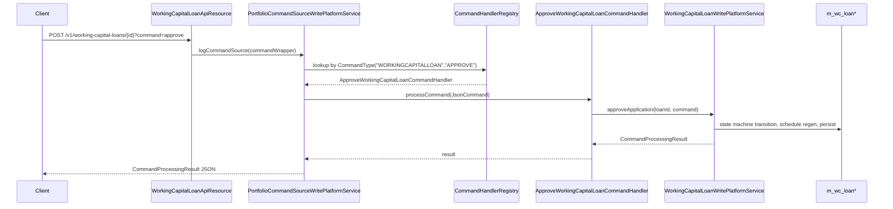
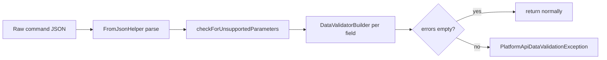

The Apache Fineract `fineract-working-capital-loan` module presents its REST surface through six JAX-RS resources under `portfolio/workingcapitalloan/api/`, dispatches state-changing requests through 14 typed `@CommandType` handlers in `handler/`, projects entities into DTOs with MapStruct mappers in `mapper/`, and validates JSON payloads through Gson-based validators in `serialization/`. This page covers each layer in source order.

## Resource map

```
portfolio/workingcapitalloan/api/
├── WorkingCapitalLoanApiResource.java               # /v1/working-capital-loans
├── WorkingCapitalLoanApiResourceSwagger.java        # OpenAPI schemas
├── WorkingCapitalLoanTransactionsApiResource.java   # /v1/working-capital-loans/{id}/transactions
├── WorkingCapitalLoanTransactionsApiResourceSwagger.java
├── WorkingCapitalLoanAmortizationScheduleApiResource.java # /v1/working-capital-loans/{id}/amortization-schedule
├── WorkingCapitalLoanBreachScheduleApiResource.java       # /v1/working-capital-loans/{id}/breach-schedule
├── WorkingCapitalLoanDelinquencyActionApiResource.java    # /v1/working-capital-loans/{id}/delinquency-actions
├── WorkingCapitalLoanDelinquencyActionApiResourceSwagger.java
├── WorkingCapitalLoanDelinquencyRangeScheduleApiResource.java # /v1/working-capital-loans/{id}/delinquency-range-schedule
└── InternalWorkingCapitalLoanApiResource.java       # /v1/internal/working-capital-loans (test only)
```

All resources are JAX-RS components scanned by the Fineract bootstrap. None of them carry `@Conditional(...)` — the working capital module is always on the classpath; gating happens further down at the service layer when needed.

## `WorkingCapitalLoanApiResource`

The headline resource. It is mounted at `/v1/working-capital-loans` and exposes the *application lifecycle* (submit, modify, delete, state transitions) plus read endpoints for the loan, its template, the delinquency-tag history, the discount and payment-rate update endpoints, and the rate-change history.

```java title="fineract-working-capital-loan/src/main/java/org/apache/fineract/portfolio/workingcapitalloan/api/WorkingCapitalLoanApiResource.java"
@Component
@Path("/v1/working-capital-loans")
@Tag(name = "Working Capital Loans", description = "Working Capital Loan applications")
@RequiredArgsConstructor
public class WorkingCapitalLoanApiResource {

    private static final String RESOURCE_NAME_FOR_PERMISSIONS = WorkingCapitalLoanConstants.WCL_RESOURCE_NAME;

    private final PlatformSecurityContext context;
    private final WorkingCapitalLoanApplicationReadPlatformService readPlatformService;
    private final PortfolioCommandSourceWritePlatformService commandsSourceWritePlatformService;
    private final WorkingCapitalLoanDelinquencyReadPlatformService workingCapitalLoanDelinquencyReadPlatformService;
    private final WorkingCapitalLoanPeriodPaymentRateChangeReadService rateChangeReadService;
```

### Endpoint table

| Method | Path | OperationId | Purpose |
| --- | --- | --- | --- |
| `GET` | `/v1/working-capital-loans/template` | `retrieveWorkingCapitalLoanTemplate` | Template DTO with `productOptions`, `fundOptions`, `delinquencyBucketOptions`, `periodFrequencyTypeOptions`. |
| `GET` | `/v1/working-capital-loans` | `retrieveAllWorkingCapitalLoans` | Paged list (`page`, `size`, `sort=field,dir`). |
| `GET` | `/v1/working-capital-loans/{loanId}` | `retrieveWorkingCapitalLoanById` | Single loan. |
| `GET` | `/v1/working-capital-loans/external-id/{loanExternalId}` | `retrieveWorkingCapitalLoanByExternalId` | Single loan by external id. |
| `POST` | `/v1/working-capital-loans` | `submitWorkingCapitalLoanApplication` | Submit a new application. |
| `PUT` | `/v1/working-capital-loans/{loanId}` | `modifyWorkingCapitalLoanApplicationById` | Modify (only `SUBMITTED_AND_PENDING_APPROVAL`). |
| `DELETE` | `/v1/working-capital-loans/{loanId}` | `deleteWorkingCapitalLoanApplication` | Delete (only `SUBMITTED_AND_PENDING_APPROVAL`). |
| `PUT` | `/v1/working-capital-loans/external-id/{loanExternalId}` | `modifyWorkingCapitalLoanApplicationByExternalId` | PUT by external id. |
| `DELETE` | `/v1/working-capital-loans/external-id/{loanExternalId}` | `deleteWorkingCapitalLoanApplicationByExternalId` | DELETE by external id. |
| `GET` | `/v1/working-capital-loans/{loanId}/delinquencyrangetags` | `getDelinquencyRangeScheduleTagHistoryById` | Tag history. |
| `GET` | `/v1/working-capital-loans/external-id/{externalId}/delinquencyrangetags` | `getDelinquencyRangeScheduleTagHistoryByExternalId` | Tag history by external id. |
| `POST` | `/v1/working-capital-loans/{loanId}` | `stateTransitionWorkingCapitalLoanById` | Approve / Reject / Undo-approve / Disburse / Undo-disburse — see [state command](#state-command). |
| `POST` | `/v1/working-capital-loans/external-id/{loanExternalId}` | `stateTransitionWorkingCapitalLoanByExternalId` | Same by external id. |
| `PUT` | `/v1/working-capital-loans/{loanId}/discount` | — | Update discount fee. |
| `PUT` | `/v1/working-capital-loans/external-id/{loanExternalId}/discount` | — | Same by external id. |
| `PUT` | `/v1/working-capital-loans/{loanId}/payment-rate` | — | Submit a mid-life rate change. |
| `PUT` | `/v1/working-capital-loans/external-id/{loanExternalId}/payment-rate` | — | Same by external id. |
| `GET` | `/v1/working-capital-loans/{loanId}/rate-changes` | — | Rate-change history. |
| `GET` | `/v1/working-capital-loans/external-id/{loanExternalId}/rate-changes` | — | Same by external id. |

### State command dispatch {#state-command}

The five workflow transitions share a single dispatcher:

```java title="fineract-working-capital-loan/src/main/java/org/apache/fineract/portfolio/workingcapitalloan/api/WorkingCapitalLoanApiResource.java"
private CommandProcessingResult handleStateTransition(final Long loanId, final String loanExternalIdStr, final String commandParam,
        final String apiRequestBodyAsJson) {
    ...
    CommandWrapper commandRequest = null;
    if (CommandParameterUtil.is(commandParam, "approve")) {
        commandRequest = builder.approveWorkingCapitalLoanApplication(resolvedLoanId).build();
    } else if (CommandParameterUtil.is(commandParam, "reject")) {
        commandRequest = builder.rejectWorkingCapitalLoanApplication(resolvedLoanId).build();
    } else if (CommandParameterUtil.is(commandParam, "undoapproval")) {
        commandRequest = builder.undoWorkingCapitalLoanApplicationApproval(resolvedLoanId).build();
    } else if (CommandParameterUtil.is(commandParam, "disburse")) {
        commandRequest = builder.disburseWorkingCapitalLoanApplication(resolvedLoanId).build();
    } else if (CommandParameterUtil.is(commandParam, "undodisbursal")) {
        commandRequest = builder.undoWorkingCapitalLoanApplicationDisbursal(resolvedLoanId).build();
    }
    ...
}
```

| `command` value | Builder method | Handler |
| --- | --- | --- |
| `approve` | `approveWorkingCapitalLoanApplication(id)` | `ApproveWorkingCapitalLoanCommandHandler` |
| `reject` | `rejectWorkingCapitalLoanApplication(id)` | `RejectWorkingCapitalLoanCommandHandler` |
| `undoapproval` | `undoWorkingCapitalLoanApplicationApproval(id)` | `UndoApproveWorkingCapitalLoanCommandHandler` |
| `disburse` | `disburseWorkingCapitalLoanApplication(id)` | `DisburseWorkingCapitalLoanCommandHandler` |
| `undodisbursal` | `undoWorkingCapitalLoanApplicationDisbursal(id)` | `UndoDisburseWorkingCapitalLoanCommandHandler` |

Any other value raises `UnrecognizedQueryParamException("command", commandParam)`.

## `WorkingCapitalLoanTransactionsApiResource`

Repayments, discount fees, credit-balance refunds, goodwill credits all flow through this resource:

```java title="fineract-working-capital-loan/src/main/java/org/apache/fineract/portfolio/workingcapitalloan/api/WorkingCapitalLoanTransactionsApiResource.java"
@Path("/v1/working-capital-loans")
```

### Endpoint table

| Method | Path | Purpose |
| --- | --- | --- |
| `GET` | `/v1/working-capital-loans/{loanId}/transactions` | Paged list. |
| `GET` | `/v1/working-capital-loans/external-id/{loanExternalId}/transactions` | Paged list by external id. |
| `GET` | `/v1/working-capital-loans/{loanId}/transactions/{transactionId}` | Single. |
| `GET` | `/v1/working-capital-loans/{loanId}/transactions/external-id/{externalTransactionId}` | Single by external txn id. |
| `GET` | `/v1/working-capital-loans/external-id/{loanExternalId}/transactions/{transactionId}` | Mixed-id lookup. |
| `GET` | `/v1/working-capital-loans/external-id/{loanExternalId}/transactions/external-id/{externalTransactionId}` | Both external. |
| `GET` | `/v1/working-capital-loans/{loanId}/template` | Per-loan transaction template (`templateType` selects which command type to template). |
| `POST` | `/v1/working-capital-loans/{loanId}/transactions` | Execute a transaction; `command` selects the type. |
| `POST` | `/v1/working-capital-loans/external-id/{loanExternalId}/transactions` | Same by external id. |

### Transaction command dispatch

```java title="fineract-working-capital-loan/src/main/java/org/apache/fineract/portfolio/workingcapitalloan/api/WorkingCapitalLoanTransactionsApiResource.java"
private CommandProcessingResult executeTransaction(final Long loanId, final String loanExternalIdStr, final String commandParam,
        final String apiRequestBodyAsJson) {
    ...
    final CommandWrapper commandRequest;
    if (CommandParameterUtil.is(commandParam, "repayment")) {
        commandRequest = builder.repaymentWorkingCapitalLoanTransaction(resolvedLoanId).build();
    } else if (CommandParameterUtil.is(commandParam, "creditBalanceRefund")) {
        commandRequest = builder.creditBalanceRefundWorkingCapitalLoanTransaction(resolvedLoanId).build();
    } else if (CommandParameterUtil.is(commandParam, GOODWILL_CREDIT_LOAN_COMMAND)) {
        commandRequest = builder.goodwillCreditWorkingCapitalLoanTransaction(resolvedLoanId).build();
    } else {
        throw new UnrecognizedQueryParamException("command", commandParam);
    }
    return this.commandsSourceWritePlatformService.logCommandSource(commandRequest);
}
```

| `command` value | Constant | Handler |
| --- | --- | --- |
| `repayment` | — | `RepaymentWorkingCapitalLoanCommandHandler` |
| `creditBalanceRefund` | — | `CreditBalanceRefundWorkingCapitalLoanCommandHandler` |
| `goodwillCredit` | `WorkingCapitalLoanConstants.GOODWILL_CREDIT_LOAN_COMMAND` | `WorkingCapitalLoanGoodwillCreditCommandHandler` |

Discount-fee creation (`WorkingCapitalLoanDiscountFeeCommandHandler`) is reached not by this resource but by the `PUT /discount` endpoint on the application resource.

## `WorkingCapitalLoanAmortizationScheduleApiResource`

Single GET that serves the persisted projected schedule:

```java title="fineract-working-capital-loan/src/main/java/org/apache/fineract/portfolio/workingcapitalloan/api/WorkingCapitalLoanAmortizationScheduleApiResource.java"
@Path("/v1/working-capital-loans")
...
    @GET
    @Path("{loanId}/amortization-schedule")
```

The read service deserialises the `ProjectedAmortizationLoanModel` JSON blob and serves the resulting `ProjectedAmortizationScheduleData`. See [Calc and Schedule](/working-capital-loan/calc-and-schedule) for the model.

## `WorkingCapitalLoanBreachScheduleApiResource`

```java title="fineract-working-capital-loan/src/main/java/org/apache/fineract/portfolio/workingcapitalloan/api/WorkingCapitalLoanBreachScheduleApiResource.java"
@Path("/v1/working-capital-loans/{loanId}/breach-schedule")
```

One GET — returns the per-period breach rows generated by the COB step.

## `WorkingCapitalLoanDelinquencyRangeScheduleApiResource`

```java
@Path("/v1/working-capital-loans/{loanId}/delinquency-range-schedule")
```

One GET — returns the per-period delinquency rows.

## `WorkingCapitalLoanDelinquencyActionApiResource`

Operator-driven pause/resume actions on delinquency accrual:

```java title="fineract-working-capital-loan/src/main/java/org/apache/fineract/portfolio/workingcapitalloan/api/WorkingCapitalLoanDelinquencyActionApiResource.java"
@Path("/v1/working-capital-loans")
```

### Endpoint table

| Method | Path | Handler |
| --- | --- | --- |
| `POST` | `/v1/working-capital-loans/{loanId}/delinquency-actions` | `CreateWorkingCapitalLoanDelinquencyActionCommandHandler` |
| `POST` | `/v1/working-capital-loans/external-id/{loanExternalId}/delinquency-actions` | Same |
| `GET` | `/v1/working-capital-loans/{loanId}/delinquency-actions` | — |
| `GET` | `/v1/working-capital-loans/external-id/{loanExternalId}/delinquency-actions` | — |

The POST is validated by `WorkingCapitalLoanDelinquencyActionParseAndValidator` (under `validator/`) — see [Domain and Product](/working-capital-loan/domain-and-product).

## `InternalWorkingCapitalLoanApiResource`

Test-only seam used by integration tests to trigger COB-internal flows synchronously:

```java title="fineract-working-capital-loan/src/main/java/org/apache/fineract/portfolio/workingcapitalloan/api/InternalWorkingCapitalLoanApiResource.java"
@Path("v1/internal/working-capital-loans")
```

| Method | Path | Purpose |
| --- | --- | --- |
| `POST` | `/v1/internal/working-capital-loans/{loanId}/amortization-schedule` | Force-regenerate the schedule. |
| `POST` | `/v1/internal/working-capital-loans/{loanId}/activate` | Activate without going through the normal disburse handler. |
| `POST` | `/v1/internal/working-capital-loans/{loanId}/generate-next-delinquency-period` | Advance the delinquency range schedule one period. |
| `POST` | `/v1/internal/working-capital-loans/{loanId}/internalMakePayment` | Apply a payment bypassing the normal command pipeline. |

The internal resource is consistently named with the `internal/` prefix; production deployments typically gate it behind an additional reverse-proxy rule or feature flag.

## Command handlers

All write paths go through Fineract's `NewCommandSourceHandler` interface. Each handler is annotated with `@CommandType(entity, action)` so the dispatcher can route by string keys.

```
portfolio/workingcapitalloan/handler/
├── ApproveWorkingCapitalLoanCommandHandler
├── CreateWorkingCapitalLoanDelinquencyActionCommandHandler
├── CreditBalanceRefundWorkingCapitalLoanCommandHandler
├── DisburseWorkingCapitalLoanCommandHandler
├── RejectWorkingCapitalLoanCommandHandler
├── RepaymentWorkingCapitalLoanCommandHandler
├── UndoApproveWorkingCapitalLoanCommandHandler
├── UndoDisburseWorkingCapitalLoanCommandHandler
├── UpdateRateWorkingCapitalLoanCommandHandler
├── WorkingCapitalLoanApplicationDeletionCommandHandler
├── WorkingCapitalLoanApplicationModificationCommandHandler
├── WorkingCapitalLoanApplicationSubmittalCommandHandler
├── WorkingCapitalLoanDiscountFeeCommandHandler
└── WorkingCapitalLoanGoodwillCreditCommandHandler
```

### `@CommandType` table

| Handler | Entity | Action |
| --- | --- | --- |
| `WorkingCapitalLoanApplicationSubmittalCommandHandler` | `WORKINGCAPITALLOAN` | `CREATE` |
| `WorkingCapitalLoanApplicationModificationCommandHandler` | `WORKINGCAPITALLOAN` | `UPDATE` |
| `WorkingCapitalLoanApplicationDeletionCommandHandler` | `WORKINGCAPITALLOAN` | `DELETE` |
| `ApproveWorkingCapitalLoanCommandHandler` | `WORKINGCAPITALLOAN` | `APPROVE` |
| `UndoApproveWorkingCapitalLoanCommandHandler` | `WORKINGCAPITALLOAN` | `APPROVALUNDO` |
| `RejectWorkingCapitalLoanCommandHandler` | `WORKINGCAPITALLOAN` | `REJECT` |
| `DisburseWorkingCapitalLoanCommandHandler` | `WORKINGCAPITALLOAN` | `DISBURSE` |
| `UndoDisburseWorkingCapitalLoanCommandHandler` | `WORKINGCAPITALLOAN` | `DISBURSALUNDO` |
| `RepaymentWorkingCapitalLoanCommandHandler` | `WORKINGCAPITALLOAN` | `REPAYMENT` |
| `CreditBalanceRefundWorkingCapitalLoanCommandHandler` | `WORKINGCAPITALLOAN` | `CREDITBALANCEREFUND` |
| `WorkingCapitalLoanGoodwillCreditCommandHandler` | `WORKINGCAPITALLOAN` (via `CommandWrapperConstants.ENTITY_WORKINGCAPITALLOAN`) | `GOODWILLCREDIT` |
| `WorkingCapitalLoanDiscountFeeCommandHandler` | `WORKINGCAPITALLOAN` | `DISCOUNTFEE` |
| `UpdateRateWorkingCapitalLoanCommandHandler` | `WORKINGCAPITALLOAN` | `UPDATERATE` |
| `CreateWorkingCapitalLoanDelinquencyActionCommandHandler` | `WC_DELINQUENCY_ACTION` | `CREATE` |

### Handler anatomy

Every handler follows the same shape: `@Service`, `@RequiredArgsConstructor`, `@CommandType(...)`, a `@Transactional` `processCommand(JsonCommand)` that calls one method on a write service. Example:

```java title="fineract-working-capital-loan/src/main/java/org/apache/fineract/portfolio/workingcapitalloan/handler/ApproveWorkingCapitalLoanCommandHandler.java"
@Service
@RequiredArgsConstructor
@CommandType(entity = "WORKINGCAPITALLOAN", action = "APPROVE")
public class ApproveWorkingCapitalLoanCommandHandler implements NewCommandSourceHandler {

    private final WorkingCapitalLoanWritePlatformService writePlatformService;

    @Transactional
    @Override
    public CommandProcessingResult processCommand(final JsonCommand command) {
        return this.writePlatformService.approveApplication(command.entityId(), command);
    }
}
```

This is exactly how a handler in `fineract-loan` would look — the working capital module reuses the same dispatch contract.

### Sequence: from HTTP to write service



The `PortfolioCommandSourceWritePlatformService.logCommandSource(...)` step is where Fineract's maker-checker pipeline lives: if the command needs approval it is parked in `m_portfolio_command_source`; otherwise it's executed straight through.

## MapStruct mappers

The `mapper/` package contains the entity → DTO projections used by every read service. They are MapStruct interfaces that compose into a single root mapper.

```
portfolio/workingcapitalloan/mapper/
├── WorkingCapitalLoanMapper                              # the root
├── WorkingCapitalLoanBalanceMapper
├── WorkingCapitalLoanDisbursementDetailMapper
├── WorkingCapitalLoanTransactionMapper
├── WorkingCapitalLoanSummaryMapper
├── WorkingCapitalLoanBreachScheduleMapper
├── WorkingCapitalLoanDelinquencyRangeScheduleMapper
├── WorkingCapitalLoanDelinquencyRangeScheduleTagHistoryMapper
└── ProjectedAmortizationScheduleMapper
```

### The root mapper

```java title="fineract-working-capital-loan/src/main/java/org/apache/fineract/portfolio/workingcapitalloan/mapper/WorkingCapitalLoanMapper.java"
@Mapper(config = MapstructMapperConfig.class, uses = { DelinquencyBucketMapper.class, WorkingCapitalLoanProductMapper.class,
        WorkingCapitalLoanBalanceMapper.class, WorkingCapitalLoanDisbursementDetailMapper.class, WorkingCapitalLoanTransactionMapper.class,
        WorkingCapitalBreachMapper.class, WorkingCapitalNearBreachMapper.class })
public interface WorkingCapitalLoanMapper {

    @Mapping(target = "accountNo", source = "accountNumber")
    @Mapping(target = "client", source = "client", qualifiedByName = "clientToData")
    @Mapping(target = "officeId", source = "client.office.id")
    @Mapping(target = "fundId", source = "fund.id")
    @Mapping(target = "fundName", source = "fund.name")
    @Mapping(target = "product", source = "loanProduct")
    @Mapping(target = "status", source = "loanStatus", qualifiedByName = "loanStatusData")
    @Mapping(target = "currency", source = "loanProductRelatedDetails", qualifiedByName = "monetaryCurrencyToCurrencyData")
    @Mapping(target = "periodPaymentRate", source = "loanProductRelatedDetails.periodPaymentRate")
    @Mapping(target = "repaymentEvery", source = "loanProductRelatedDetails.repaymentEvery")
    @Mapping(target = "repaymentFrequencyType", source = "loanProductRelatedDetails", qualifiedByName = "repaymentFrequencyTypeData")
    @Mapping(target = "discount", source = "loanProductRelatedDetails.discount")
    @Mapping(target = "discountProposed", source = "loanProductRelatedDetails.discountProposed")
    @Mapping(target = "discountApproved", source = "loanProductRelatedDetails.discountApproved")
    @Mapping(target = "breach", source = "loanProductRelatedDetails.breach")
    @Mapping(target = "nearBreach", source = "loanProductRelatedDetails.nearBreach")
    @Mapping(target = "delinquencyBucket", source = "loanProductRelatedDetails.delinquencyBucket")
    @Mapping(target = "balance", source = "balance")
    @Mapping(target = "paymentAllocation", source = "paymentAllocationRules", qualifiedByName = "paymentAllocationRulesToData")
    @Mapping(target = "timeline", source = "loan", qualifiedByName = "timelineData")
    @Mapping(target = "disbursementDetails", source = "disbursementDetails")
    @Mapping(target = "transactions", source = "transactions")
    @Mapping(target = "delinquencyGraceDays", source = "loanProductRelatedDetails.delinquencyGraceDays")
    @Mapping(target = "delinquencyStartType", source = "loanProductRelatedDetails", qualifiedByName = "delinquencyStartTypeData")
    @Mapping(target = "collectionData", ignore = true)
    WorkingCapitalLoanData toData(WorkingCapitalLoan loan);
```

Things to note:

- **Composition.** `uses = { … }` pulls in seven side mappers. MapStruct picks the right side mapper for each child field type, so we don't have to write child-by-child boilerplate.
- **Qualified names** (`@Mapping(qualifiedByName = "...")`) point at custom methods (declared `default` on the same interface or a `@Named` method on a side mapper) for non-trivial conversions like `Client` → `ClientData` with status, or `LoanStatus` → `LoanStatusEnumData`.
- **`collectionData` is ignored** — it's filled by a separate code path in the read service after the projection.

### Other mappers in the family

| Mapper | Source entity | Output |
| --- | --- | --- |
| `WorkingCapitalLoanBalanceMapper` | `WorkingCapitalLoanBalance` | `WorkingCapitalLoanBalanceData` |
| `WorkingCapitalLoanDisbursementDetailMapper` | `WorkingCapitalLoanDisbursementDetails` | `WorkingCapitalLoanDisbursementDetailData` |
| `WorkingCapitalLoanTransactionMapper` | `WorkingCapitalLoanTransaction` | `WorkingCapitalLoanTransactionData` |
| `WorkingCapitalLoanSummaryMapper` | (computed) | summary block on `WorkingCapitalLoanData` |
| `WorkingCapitalLoanBreachScheduleMapper` | `WorkingCapitalLoanBreachSchedule` | `WorkingCapitalLoanBreachScheduleData` |
| `WorkingCapitalLoanDelinquencyRangeScheduleMapper` | `WorkingCapitalLoanDelinquencyRangeSchedule` | `WorkingCapitalLoanDelinquencyRangeScheduleData` |
| `WorkingCapitalLoanDelinquencyRangeScheduleTagHistoryMapper` | tag history | `WorkingCapitalLoanDelinquencyTagHistoryData` |
| `ProjectedAmortizationScheduleMapper` | `ProjectedAmortizationLoanModel` (JSON-deserialised) | `ProjectedAmortizationScheduleData` |

All mappers share `MapstructMapperConfig` (centralised type strategy from `fineract-core`) so the output looks consistent across modules.

## JSON validators

`portfolio/workingcapitalloan/serialization/` houses two heavy Gson-backed validators.

### `WorkingCapitalLoanApplicationDataValidator`

Vets *application* lifecycle commands. Two public entry points:

```java title="fineract-working-capital-loan/src/main/java/org/apache/fineract/portfolio/workingcapitalloan/serialization/WorkingCapitalLoanApplicationDataValidator.java"
public class WorkingCapitalLoanApplicationDataValidator {

    public void validateForCreate(final JsonCommand command) { ... }
    public void validateForUpdate(final JsonCommand command, final WorkingCapitalLoan loan) { ... }
    public void validateForUpdate(final JsonCommand command) { ... }
    public void validateForModify(final WorkingCapitalLoan loan) { ... }

    public void handleDataIntegrityIssues(final JsonCommand command, final Throwable realCause, final Exception dve) { ... }
}
```

`validateForCreate` is invoked from `WorkingCapitalLoanApplicationSubmittalCommandHandler`, accepts the full JSON, sets up a `DataValidatorBuilder` with errors collected in a `List<ApiParameterError>`, and walks every required and optional parameter. The check set includes:

- `clientId` is a real, active client;
- `productId` resolves to an active product;
- `submittedOnDate`, `expectedDisbursementDate`, `repaymentsStartingFromDate` are not null and have sane order;
- `principal` is within the product's min/max constraints;
- `externalId` (if supplied) is not already in use.

`validateForUpdate` runs the same set when an in-flight application is modified. `validateForModify` makes the *status-state* check — only `SUBMITTED_AND_PENDING_APPROVAL` can be modified.

`handleDataIntegrityIssues` catches DB-level uniqueness violations and re-throws them as `PlatformDataIntegrityException` with a friendly message.

### `WorkingCapitalLoanDataValidator`

Vets the post-application commands: `validateForApprove`, `validateForReject`, `validateForUndoApproval`, `validateForDisburse`, `validateForUndoDisbursal`, `validateForRepayment`, `validateForCreditBalanceRefund`, `validateForDiscountFee`, `validateForGoodwillCredit`, `validateForRateChange`. Each is paired with one of the handlers above.

Both validators share the same conventions:



Unsupported parameters are rejected — Fineract refuses requests that include unknown fields, which avoids silent typos.

## Constants

The shared command-string constants live at module root:

```java title="fineract-working-capital-loan/src/main/java/org/apache/fineract/portfolio/workingcapitalloan/WorkingCapitalLoanConstants.java"
public final class WorkingCapitalLoanConstants {
    // resource name for permissions, JSON parameter names,
    // GOODWILL_CREDIT_LOAN_COMMAND etc.
}
```

`WCL_RESOURCE_NAME` is referenced as `RESOURCE_NAME_FOR_PERMISSIONS` in the resource — it's the Fineract permission key used by the security context.

## Putting it together

```mermaid
flowchart TB
  subgraph REST
    A[WorkingCapitalLoanApiResource]
    B[WorkingCapitalLoanTransactionsApiResource]
    C[Amortization / Breach / DelinquencyRange / DelinquencyAction]
    I[InternalWorkingCapitalLoanApiResource]
  end
  subgraph Commands
    Bld[CommandWrapperBuilder]
    Src[PortfolioCommandSourceWritePlatformService]
    Reg[CommandHandlerRegistry]
  end
  subgraph Handlers
    H[14 @CommandType handlers]
  end
  subgraph Services
    W[WorkingCapitalLoanWritePlatformService]
    Tx[Transaction write services]
    R[WorkingCapitalLoanApplicationReadPlatformService]
    Sch[WorkingCapitalLoanAmortizationScheduleReadService]
  end
  subgraph Calc
    Calc[ProjectedAmortizationScheduleCalculator]
  end
  subgraph Persist
    DB[(m_wc_loan*)]
  end
  subgraph DTO
    M[MapStruct mappers]
  end

  A --> Bld
  B --> Bld
  C --> Bld
  Bld --> Src
  Src --> Reg
  Reg --> H
  H --> W
  H --> Tx
  W --> Calc
  Tx --> Calc
  W --> DB
  Tx --> DB
  A --> R
  B --> R
  C --> Sch
  R --> DB
  R --> M
  Sch --> DB
```

What this means:

- The resources never touch repositories directly — read goes via `*ReadPlatformService`, write goes via `CommandWrapperBuilder` → command source → registry → handler → write service.
- The handlers themselves are paper-thin; the real work is in the write services and the calculator.
- The MapStruct mappers project the entity graph to the wire DTOs at the very last step.

## Where to read next

- [Domain and Product](/working-capital-loan/domain-and-product) — every entity behind these endpoints.
- [Calc and Schedule](/working-capital-loan/calc-and-schedule) — the calculator the handlers invoke.
- [COB business steps](/working-capital-loan/cob-business-steps) — the daily batch that consumes the schedule and writes breach/delinquency periods.
