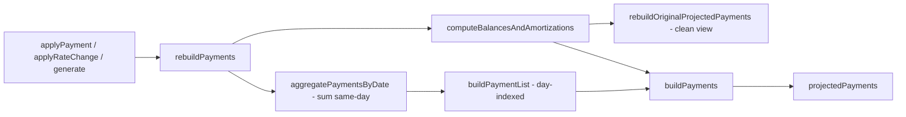
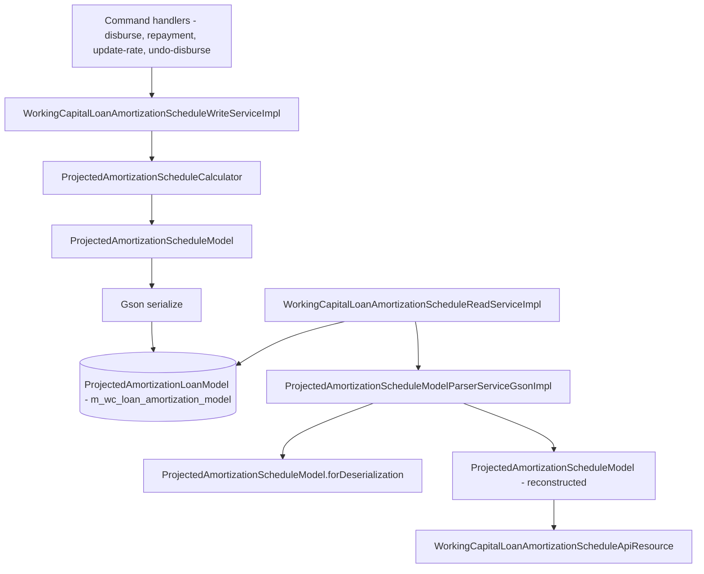

The Apache Fineract `fineract-working-capital-loan` module ships its own amortisation engine that has nothing in common with the progressive or declining-balance calculators in `fineract-loan`. Working capital (WC) loans are *discount-fee* products with multiple disbursements per application, a daily payment rate, mid-life rate changes, and a schedule that is mutated in-place as actual payments and disbursements arrive. The entire calculation surface lives in five classes under `fineract-working-capital-loan/src/main/java/org/apache/fineract/portfolio/workingcapitalloan/calc/`:

```
calc/
├── ProjectedAmortizationScheduleCalculator.java         # Service interface
├── DefaultProjectedAmortizationScheduleCalculator.java  # Default impl (Spring @Component)
├── ProjectedAmortizationScheduleModel.java              # The in-memory schedule
├── ProjectedPayment.java                                # One row of the schedule
└── TvmFunctions.java                                    # RATE and discount factor helpers
```

This page walks each class in source order, explains the discount-fee economics that make this calculator distinctive, and shows how multi-tranche disbursement and mid-life rate changes are handled.

## The interface: `ProjectedAmortizationScheduleCalculator`

```java title="fineract-working-capital-loan/src/main/java/org/apache/fineract/portfolio/workingcapitalloan/calc/ProjectedAmortizationScheduleCalculator.java"
/**
 * Calculator service for Working Capital loan projected amortization schedule. Analogous to {@code EMICalculator} for
 * progressive loans, but with a minimal API: generation, disbursement and payment.
 */
public interface ProjectedAmortizationScheduleCalculator {

    @NonNull
    ProjectedAmortizationScheduleModel generateModel(@NonNull BigDecimal discountFeeAmount, @NonNull BigDecimal netDisbursementAmount,
            @NonNull BigDecimal totalPaymentValue, @NonNull BigDecimal periodPaymentRate, int npvDayCount,
            @NonNull LocalDate expectedDisbursementDate, @NonNull MathContext mc, @NonNull CurrencyData currency);

    @NonNull
    ProjectedAmortizationScheduleModel addDisbursement(@NonNull ProjectedAmortizationScheduleModel model,
            @NonNull BigDecimal newDiscountAmount, @NonNull BigDecimal newNetAmount, @NonNull LocalDate newStartDate);

    void applyPayment(@NonNull ProjectedAmortizationScheduleModel model, @NonNull LocalDate paymentDate, @NonNull BigDecimal paymentAmount);

    @NonNull
    ProjectedAmortizationScheduleModel applyRateChange(@NonNull ProjectedAmortizationScheduleModel model,
            @NonNull BigDecimal newPeriodPaymentRate, @NonNull LocalDate rateChangeDate);
}
```

Four operations:

| Method | When called | Behaviour |
| --- | --- | --- |
| `generateModel` | Loan submittal | Builds a fresh `ProjectedAmortizationScheduleModel` with no payments. |
| `addDisbursement` | Approval and each actual disbursement | Returns a *new* model with refreshed amounts but **preserves** the actual payments already applied. |
| `applyPayment` | Each repayment / discount fee / refund | Mutates the supplied model in place — the schedule is rebuilt around the new payment. |
| `applyRateChange` | Rate-change command | Mutates in place; adds a `RateSegment` covering the remaining term. |

The contract notes this is *analogous to `EMICalculator`* (the progressive loan engine), but the API is deliberately minimal — there are no transaction-type-specific entry points. The `WorkingCapitalLoanAmortizationScheduleWriteService` and the repayment handlers are responsible for translating their domain events into one of these four operations.

## The default implementation

`DefaultProjectedAmortizationScheduleCalculator` is a thin Spring `@Component` that delegates to static methods on the model:

```java title="fineract-working-capital-loan/src/main/java/org/apache/fineract/portfolio/workingcapitalloan/calc/DefaultProjectedAmortizationScheduleCalculator.java"
@Component
public final class DefaultProjectedAmortizationScheduleCalculator implements ProjectedAmortizationScheduleCalculator {

    @Override
    public ProjectedAmortizationScheduleModel generateModel(...) {
        return ProjectedAmortizationScheduleModel.generate(discountFeeAmount, netDisbursementAmount, totalPaymentValue, periodPaymentRate,
                npvDayCount, expectedDisbursementDate, mc, currency);
    }

    @Override
    public ProjectedAmortizationScheduleModel addDisbursement(...) {
        return model.regenerate(newDiscountAmount, newNetAmount, newStartDate);
    }

    @Override
    public void applyPayment(final ProjectedAmortizationScheduleModel model, final LocalDate paymentDate, final BigDecimal paymentAmount) {
        model.applyPayment(paymentDate, paymentAmount);
    }

    @Override
    public ProjectedAmortizationScheduleModel applyRateChange(final ProjectedAmortizationScheduleModel model,
            final BigDecimal newPeriodPaymentRate, final LocalDate rateChangeDate) {
        model.applyRateChange(newPeriodPaymentRate, rateChangeDate);
        return model;
    }
}
```

The decision to keep the rich behaviour on the model class — rather than spreading it across the service — pays off when the model has to be persisted as JSON via Gson (see [Domain and Product](/working-capital-loan/domain-and-product) for `ProjectedAmortizationLoanModel`): the same class is both runtime model and persistence model.

## Discount-fee economics in one glance

WC loans are priced as a *discount product*: the borrower receives `netDisbursementAmount` cash but agrees to repay `netDisbursementAmount + discountFeeAmount`. The lender's income is the discount fee, recognised over the term as each daily payment lands.

```
Gross           = netDisbursementAmount + discountFeeAmount
Daily payment   = (totalPaymentValue × periodPaymentRate) / npvDayCount
Term (days)     = ceil(Gross / Daily payment)
EIR (per day)   = TVM RATE(term, -dailyPayment, netDisbursementAmount)
```

The fields are computed eagerly when the model is generated. Once they exist the *projected* payments are rebuilt from scratch every time anything changes — the model is *re-projection oriented*, not delta-oriented.

## The model class

The model is `final` and immutable from the outside — the constructor is private, and the only public mutators are `applyPayment`, `applyRateChange`, `removeLastRateChange`, and `clearLastRateSegment`. Internally it holds three lists:

```java title="fineract-working-capital-loan/src/main/java/org/apache/fineract/portfolio/workingcapitalloan/calc/ProjectedAmortizationScheduleModel.java"
@Getter(AccessLevel.NONE)
@SerializedName(value = "actualPayments", alternate = "appliedPayments")
private final List<ActualPayment> actualPayments;

@Getter(AccessLevel.NONE)
private final List<RateSegment> rateSegments;

@Getter(AccessLevel.NONE)
@SerializedName(value = "projectedPayments", alternate = "payments")
private List<ProjectedPayment> projectedPayments;

@Getter(AccessLevel.NONE)
private List<ProjectedPayment> originalProjectedPayments;
```

`@SerializedName(... alternate = ...)` is Gson telling the parser to accept either spelling — so older JSON snapshots persisted under the v1 names (`appliedPayments`, `payments`) still deserialise.

### Field reference

| Field | Source | Notes |
| --- | --- | --- |
| `discountFeeAmount` | input | Fee earned by the lender over the term. |
| `netDisbursementAmount` | input | Cash given to the borrower. |
| `totalPaymentValue` | input | Reference notional used to derive the daily payment. |
| `periodPaymentRate` | input | Daily rate multiplier. |
| `npvDayCount` | input | Day-count basis (e.g. 360, 365). |
| `expectedDisbursementDate` | input | The day before installment #1. |
| `expectedPaymentAmount` | computed | `TPV × rate / dayCount` — the canonical daily payment. |
| `originalPaymentNumber` | computed | `ceil(gross / expectedPaymentAmount)` — initial term. |
| `effectiveInterestRate` | computed | TVM `RATE(originalPaymentNumber, -expectedPaymentAmount, netDisbursementAmount)`. |
| `actualPayments` | mutable | Payments received so far. |
| `rateSegments` | mutable | Applied rate changes (segment per change). |
| `projectedPayments` | rebuilt | Day-keyed `ProjectedPayment` rows including paid ones. |
| `originalProjectedPayments` | rebuilt | "What it should look like if no payments had been irregular" view. |

### MODEL_VERSION

```java
private static final String MODEL_VERSION = "3";
```

This string is persisted on each `ProjectedAmortizationLoanModel` row alongside the JSON blob. When the read service re-hydrates a snapshot it can refuse old versions or run a migration.

### `forDeserialization`

Gson cannot call the rich constructor (it needs final fields injected via reflection). The model provides a no-arg-skeleton constructor:

```java
public static ProjectedAmortizationScheduleModel forDeserialization(final MathContext mc, final CurrencyData currency) {
    return new ProjectedAmortizationScheduleModel(mc, currency);
}
```

The deserializer side (see [API & handlers](/working-capital-loan/api-and-handlers)) uses this seed instance, lets Gson stamp the inputs and the payment lists, and is done — the payments are restored from JSON, not rebuilt.

## Building the initial model

```java title="fineract-working-capital-loan/src/main/java/org/apache/fineract/portfolio/workingcapitalloan/calc/ProjectedAmortizationScheduleModel.java"
public static ProjectedAmortizationScheduleModel generate(final BigDecimal discountFeeAmount, final BigDecimal netDisbursementAmount,
        final BigDecimal totalPaymentValue, final BigDecimal periodPaymentRate, final int npvDayCount,
        final LocalDate expectedDisbursementDate, final MathContext mc, final CurrencyData currency) {

    Objects.requireNonNull(discountFeeAmount, "discountFeeAmount");
    Objects.requireNonNull(netDisbursementAmount, "netDisbursementAmount");
    ...
    if (netDisbursementAmount.signum() <= 0) {
        throw new IllegalArgumentException("netDisbursementAmount must be positive");
    }
    if (npvDayCount <= 0) {
        throw new IllegalArgumentException("npvDayCount must be positive");
    }

    final BigDecimal expectedPayment = totalPaymentValue.multiply(periodPaymentRate, mc).divide(BigDecimal.valueOf(npvDayCount), mc);
    if (expectedPayment.signum() <= 0) {
        throw new IllegalArgumentException("expectedPaymentAmount must be positive (check totalPaymentValue and periodPaymentRate)");
    }

    final int originalPaymentNumber = netDisbursementAmount.add(discountFeeAmount, mc).divide(expectedPayment, mc)
            .setScale(0, RoundingMode.UP).intValueExact();
    if (originalPaymentNumber <= 0) {
        throw new IllegalArgumentException("computed originalPaymentNumber must be positive, got: " + originalPaymentNumber);
    }

    final BigDecimal eir = TvmFunctions.rate(originalPaymentNumber, expectedPayment.negate(), netDisbursementAmount, mc);

    return new ProjectedAmortizationScheduleModel(Money.of(currency, discountFeeAmount, mc),
            Money.of(currency, netDisbursementAmount, mc), Money.of(currency, totalPaymentValue, mc), periodPaymentRate, npvDayCount,
            expectedDisbursementDate, Money.of(currency, expectedPayment, mc), originalPaymentNumber, eir, mc, currency);
}
```

What stands out:

- `RoundingMode.UP` — the term is always rounded up so the gross is fully covered even if the last installment is smaller than the daily payment.
- `TvmFunctions.rate(...)` — Newton-Raphson solver for the periodic interest rate. See [TVM helpers](#tvm-helpers).
- All amounts are wrapped in `Money` (the Fineract value object that pairs an amount with a currency). The model never works in raw `BigDecimal` for monetary fields, which prevents accidental cross-currency arithmetic.
- The private constructor immediately calls `rebuildPayments()` to populate `projectedPayments`.

## The payment row: `ProjectedPayment`

Each day of the schedule is one `ProjectedPayment` record:

```java title="fineract-working-capital-loan/src/main/java/org/apache/fineract/portfolio/workingcapitalloan/calc/ProjectedPayment.java"
public class ProjectedPayment {

    /** 1-based payment number (0 = disbursement row). */
    private final int paymentNo;
    private final LocalDate date;

    /** Exponent for discount factor: {@code DF = 1/(1+EIR)^paymentsLeft}. Zero for paid periods. */
    private final long paymentsLeft;

    /** {@code (TPV × periodRate) / dayCount}; negated disbursement for row 0. */
    private final Money expectedPaymentAmount;

    /** Running expected payment: always the expected amount, adjusted for excess from the tail; {@code null} for row 0. */
    private final Money forecastPaymentAmount;

    /** {@code 1 / (1 + EIR)^paymentsLeft} */
    private final BigDecimal discountFactor;

    /** {@code forecastPayment × discountFactor} */
    private final Money npvValue;

    /** {@code balance[i] = balance[i-1] × (1+EIR) - expectedPayment} */
    private final Money balance;

    /** {@code balance[i] + expectedPayment - balance[i-1]} (equivalent to {@code prevBalance × EIR}) */
    private final Money expectedAmortizationAmount;

    /** First paid: sum of all NPV values; subsequent: {@code totalAmort[i-1] - actualAmort[i-1]}. */
    private final Money totalAmortizedAmount;

    private final Money actualPaymentAmount;

    /** Cursor-based consumption of expected amortization proportional to payment ratio. */
    private final Money actualAmortizationAmount;

    /** {@code actualAmortization - expectedAmortization} */
    private final Money incomeModification;

    /** {@code deferredBalance[i-1] - actualAmortization[i]} */
    private final Money deferredBalance;
}
```

The Javadoc on each field tells you exactly what to compute — the model class is the only place that reads/writes these. Row `0` (disbursement) carries the negated disbursement in `expectedPaymentAmount` and zero forecast.

## Normalising a payment date

Real-world payments don't land on neat schedule dates. The model normalises:

```java
public LocalDate normalizePaymentDateForSchedule(final LocalDate paymentDate) {
    Objects.requireNonNull(paymentDate, "paymentDate");
    final LocalDate firstInstallmentDate = expectedDisbursementDate.plusDays(1);
    final LocalDate lastInstallmentDate = expectedDisbursementDate.plusDays(effectiveTotalTerm());
    if (paymentDate.isBefore(firstInstallmentDate) || paymentDate.equals(expectedDisbursementDate)) {
        return firstInstallmentDate;
    }
    ...
    final ProjectedPayment nearestUnpaid = projectedPayments.stream().filter(p -> p.paymentNo() > 0)
            .filter(p -> p.actualPaymentAmount() == null).findFirst().orElse(null);
    if (nearestUnpaid != null && nearestUnpaid.date() != null) {
        if (nearestUnpaid.date().isBefore(firstInstallmentDate)) {
            return firstInstallmentDate;
        }
        if (nearestUnpaid.date().isAfter(lastInstallmentDate)) {
            return lastInstallmentDate;
        }
        return nearestUnpaid.date();
    }
    return paymentDate;
}
```

Logic:

1. If the payment lands on or before disbursement day → clamp to day 1.
2. Otherwise pick the first unpaid scheduled date in `[day 1 .. lastInstallmentDate]`.
3. As a fallback, return the supplied date.

This lets repayments before the schedule starts, or out-of-order payments, still apply to the right bucket.

## Applying a payment

```java
public void applyPayment(final LocalDate paymentDate, final BigDecimal amount) {
    Objects.requireNonNull(paymentDate, "paymentDate");
    Objects.requireNonNull(amount, "amount");
    final LocalDate scheduleDate = normalizePaymentDateForSchedule(paymentDate);
    final int index = resolvePaymentIndex(scheduleDate);
    if (index < 0 || index >= effectiveTotalTerm()) {
        throw new IllegalArgumentException("paymentDate " + paymentDate + " is outside the valid range ["
                + expectedDisbursementDate.plusDays(1) + " .. " + expectedDisbursementDate.plusDays(effectiveTotalTerm()) + "]");
    }
    actualPayments.add(new ActualPayment(scheduleDate, money(amount)));
    rebuildPayments();
}
```

Three steps: normalise, validate range, append to `actualPayments`, rebuild the whole projection. The rebuild is the workhorse — every applied payment recomputes balances, forecasts, deferred balance, NPVs, and trims trailing zero rows.

## Multi-tranche regeneration

When the operator records an *actual* tranche disbursement (or approval edits the planned figures), the calculator calls `regenerate`:

```java
public ProjectedAmortizationScheduleModel regenerate(final BigDecimal newDiscountAmount, final BigDecimal newNetAmount,
        final LocalDate newStartDate) {
    final ProjectedAmortizationScheduleModel newModel = generate(newDiscountAmount, newNetAmount, totalPaymentValue.getAmount(),
            periodPaymentRate, npvDayCount, newStartDate, mc, currency);
    newModel.actualPayments.addAll(actualPayments);
    newModel.rebuildPayments();
    return newModel;
}
```

It builds a brand-new model with the new amounts and start date, copies over the `actualPayments` (so historical repayments aren't lost), and rebuilds. The caller persists the new model under the same loan id, replacing the prior JSON blob.

Why a *new* model rather than mutating the old one? Two reasons:

1. `discountFeeAmount`, `netDisbursementAmount`, `expectedPaymentAmount`, `originalPaymentNumber`, `effectiveInterestRate` are `final`. JPA-style mutation is not an option.
2. A fresh model means the rebuild can use `RoundingMode.UP` from scratch — no risk of carrying tiny rounding artefacts across regenerations.

## Mid-life rate changes

The rate-change path is the most algorithmically interesting. Operators can post a new `periodPaymentRate` mid-loan; the calculator splices in a `RateSegment` and rebuilds the daily roll-forward.

```java title="fineract-working-capital-loan/src/main/java/org/apache/fineract/portfolio/workingcapitalloan/calc/ProjectedAmortizationScheduleModel.java"
public void applyRateChange(final BigDecimal newPeriodPaymentRate, final LocalDate rateChangeDate) {
    Objects.requireNonNull(newPeriodPaymentRate, "newPeriodPaymentRate");
    Objects.requireNonNull(rateChangeDate, "rateChangeDate");

    final int rawSplitDayIndex = (int) ChronoUnit.DAYS.between(expectedDisbursementDate, rateChangeDate);
    if (rawSplitDayIndex < 0) {
        throw new IllegalArgumentException("rateChangeDate must not be before expectedDisbursementDate");
    }

    // When the rate change is past the base schedule's term, clamp the segment start
    // to originalPaymentNumber. The loan is still active (borrower hasn't paid), so the remaining
    // balance is netDisbursement - paymentsReceived.
    final int splitDayIndex = Math.min(rawSplitDayIndex, originalPaymentNumber);

    // Remove existing segments at or after split (supports overwrite on second rate change)
    ...
    rateSegments.removeIf(s -> s.startDayIndex() >= splitDayIndex);
```

Highlights:

- The split-day index is *days since disbursement*. If the rate change is after the original term, it is clamped to the last day so the segment still has a valid start.
- Existing segments at or after the split are removed first — this gives "overwrite-on-second-change" semantics.
- Payments received before the split are tallied so the balance at split is correct.

The balance-at-split logic handles three regimes:

```java
final BigDecimal balanceAtSplit;
if (rawSplitDayIndex >= originalPaymentNumber) {
    balanceAtSplit = netDisbursementAmount.getAmount().subtract(paymentsReceived, mc);
} else if (splitDayIndex > 1) {
    final int lastBasePeriod = splitDayIndex - 1;
    final BalancesAndAmortizations ba = computeBaseBalancesUpTo(lastBasePeriod);
    balanceAtSplit = ba.balances().get(lastBasePeriod - 1).getAmount();
} else {
    balanceAtSplit = netDisbursementAmount.getAmount();
}
```

| Case | Balance at split |
| --- | --- |
| Rate change after end of base term | `netDisbursement − paymentsReceived` (treat unpaid principal as outstanding). |
| Rate change at day `n > 1` within the base term | The base schedule's balance at day `n-1`. |
| Rate change on day 1 | The full `netDisbursementAmount`. |

A new `RateSegment` is then constructed with its own effective interest rate and term:

```java
final BigDecimal newDailyPayment = tpv.multiply(newPeriodPaymentRate, mc).divide(BigDecimal.valueOf(npvDayCount), mc)
        .setScale(scale, mc.getRoundingMode());
final BigDecimal fractionalTotalDays = newNetDisb.add(newDiscount, mc).divide(newDailyPayment, mc).setScale(scale,
        mc.getRoundingMode());
final int newTerm = fractionalTotalDays.intValue();

final int safeTerm = Math.max(newTerm, 1);
...
final BigDecimal newEir = TvmFunctions.rate(safeTerm, newDailyPayment.negate(), newNetDisb, mc);

rateSegments.add(new RateSegment(splitDayIndex, money(newDailyPayment), safeTerm, newEir, money(newNetDisb), money(newDiscount)));
rateSegments.sort(Comparator.comparingInt(RateSegment::startDayIndex));

rebuildPayments();
```

The segment carries enough state to roll forward independently:

```java
public record RateSegment(int startDayIndex, Money expectedPaymentAmount, int segmentTerm, BigDecimal effectiveInterestRate,
        Money netDisbursementAtSplit, Money discountAtSplit) {
}
```

The roll-forward — driven by `segmentForDay(dayIndex)` and `computeBalancesAndAmortizations()` — picks up the active segment at each day:

```java
private BalancesAndAmortizations computeBalancesAndAmortizations() {
    final int totalTerm = effectiveTotalTerm();
    ...
    for (int i = 0; i < totalTerm; i++) {
        final int dayIndex = i + 1;
        final RateSegment seg = segmentForDay(dayIndex);
        // At segment boundary, reset balance to segment's net disbursement
        if (seg != null && seg.startDayIndex() == dayIndex) {
            prevBalance = seg.netDisbursementAtSplit().getAmount();
        }
        final BigDecimal eir = seg != null ? seg.effectiveInterestRate() : effectiveInterestRate;
        final BigDecimal payment = seg != null ? seg.expectedPaymentAmount().getAmount() : expectedPaymentAmount.getAmount();
        final BigDecimal onePlusRate = BigDecimal.ONE.add(eir, mc);
        final BigDecimal balance = prevBalance.multiply(onePlusRate, mc).subtract(payment, mc);
        balances.add(money(balance));
        expectedAmortizations.add(money(balance.add(payment, mc).subtract(prevBalance, mc)));
        prevBalance = balance;
    }
    return new BalancesAndAmortizations(balances, expectedAmortizations);
}
```

### Undo support

Two helpers exist for rolling back rate changes:

```java
public void removeLastRateChange() {
    if (rateSegments != null && !rateSegments.isEmpty()) {
        rateSegments.removeLast();
        rebuildPayments();
    }
}

public void clearLastRateSegment() {
    if (rateSegments != null && !rateSegments.isEmpty()) {
        rateSegments.removeLast();
    }
}
```

`removeLastRateChange` rebuilds; `clearLastRateSegment` does not — it's used when a subsequent `applyRateChange` would rebuild anyway.

### Effective term across segments

```java
public int effectiveTotalTerm() {
    if (rateSegments == null || rateSegments.isEmpty()) {
        return originalPaymentNumber;
    }
    final RateSegment last = rateSegments.getLast();
    // When startDayIndex > 0, the segment overlaps one day with the base schedule (the split day),
    // so subtract 1. When startDayIndex == 0, there are no base days — no overlap.
    final int overlap = last.startDayIndex() > 0 ? 1 : 0;
    return last.startDayIndex() + last.segmentTerm() - overlap;
}
```

This is the *actual* number of installments, which can be longer or shorter than `originalPaymentNumber` after a rate change.

## The rebuild path

`rebuildPayments` orchestrates the full regeneration:

```java
private void rebuildPayments() {
    final BalancesAndAmortizations ba = computeBalancesAndAmortizations();
    rebuildOriginalProjectedPayments(ba);
    final Map<LocalDate, BigDecimal> paymentsByDate = aggregatePaymentsByDate();
    final List<BigDecimal> paymentList = buildPaymentList(paymentsByDate);
    this.projectedPayments = List.copyOf(buildPayments(paymentList, paymentsByDate.size(), ba));
}
```

The pipeline:



Inside `buildPayments`, three further helpers compute:

- `analyzePayments(payments, appliedCount)` — total shortfall (under-paid days) and total excess (over-paid days).
- `computeActualAmortizations(...)` — cursor-based consumption of expected amortisation proportional to the actual payment ratio.
- `computeRunningExpectedPayments(excess)` — adjusts future forecasts to absorb any prior excess so the borrower gets credit early-paid.
- `buildTailPeriodsAndComputeNpv(...)` — appends extra installments at the end to cover any aggregate shortfall.

After construction, trailing zero rows are trimmed:

```java
while (result.size() > 1) {
    final ProjectedPayment last = result.getLast();
    if (last.forecastPaymentAmount() != null && last.forecastPaymentAmount().isZero()) {
        result.removeLast();
    } else {
        break;
    }
}
```

So an over-paid loan ends with fewer rows than the original term, and an under-paid loan ends with more.

## The disbursement row

A single special row tracks the disbursement:

```java
private ProjectedPayment createDisbursementPayment() {
    final Money negDisbursement = netDisbursementAmount.negated(mc);
    return new ProjectedPayment(0, expectedDisbursementDate, 0L, negDisbursement, null, BigDecimal.ONE, negDisbursement,
            netDisbursementAmount, null, null, null, null, null, discountFeeAmount);
}
```

`paymentNo = 0`, `discountFactor = 1`, NPV equals the negated disbursement. Putting this row first makes downstream consumers (reporting, accounting) able to walk the list as a contiguous cashflow stream including the initial outflow.

## Recalculating net amortization and deferred balance

```java
public void recalculateNetAmortizationAndDeferredBalanceFrom(final LocalDate repaymentDate) {
    if (repaymentDate == null || projectedPayments == null || projectedPayments.isEmpty()) {
        return;
    }
    final ProjectedPayment lastRepayment = projectedPayments.stream().filter(p -> p.paymentNo() > 0)
            .filter(p -> repaymentDate.equals(p.date())).reduce((a, b) -> b).orElse(null);
    ...
}
```

This is called when an upstream service needs to refresh the deferred balance starting at a specific repayment date — typically after a write-off, fee waiver, or refund that doesn't fit the standard `applyPayment` flow. The function walks the projected payments and adjusts `totalAmortizedAmount` and `deferredBalance` from that row forward.

## TVM helpers {#tvm-helpers}

The two static utilities in `TvmFunctions` carry the financial mathematics.

### `rate` — Newton-Raphson RATE solver

```java title="fineract-working-capital-loan/src/main/java/org/apache/fineract/portfolio/workingcapitalloan/calc/TvmFunctions.java"
public static BigDecimal rate(final int nper, final BigDecimal pmt, final BigDecimal pv, final MathContext mc) {
    return rate(nper, pmt, pv, estimateInitialGuess(nper, pmt, pv, mc), mc);
}

private static BigDecimal rate(final int nper, final BigDecimal pmt, final BigDecimal pv, final BigDecimal guess,
        final MathContext mc) {
    if (nper <= 0) {
        throw new IllegalArgumentException("nper must be positive, got: " + nper);
    }

    final BigDecimal n = BigDecimal.valueOf(nper);

    // Zero-rate case: pv + pmt·n ≈ 0
    if (pv.add(pmt.multiply(n, mc), mc).abs().compareTo(TOLERANCE) < 0) {
        return BigDecimal.ZERO;
    }

    BigDecimal r = guess;

    for (int iter = 0; iter < MAX_ITERATIONS; iter++) {
        if (r.signum() == 0) {
            r = TOLERANCE; // nudge away from zero to avoid division by zero
        }

        final BigDecimal onePlusR = BigDecimal.ONE.add(r, mc);
        final BigDecimal compound = onePlusR.pow(nper, mc); // (1+r)^n
        final BigDecimal compoundMinusOne = compound.subtract(BigDecimal.ONE, mc);

        // f(r) = pv·(1+r)^n + pmt·((1+r)^n − 1) / r
        final BigDecimal f = pv.multiply(compound, mc).add(pmt.multiply(compoundMinusOne, mc).divide(r, mc));

        // f'(r) = pv·n·(1+r)^(n−1) + pmt·[n·(1+r)^(n−1)·r − ((1+r)^n−1)] / r²
        final BigDecimal dCompound = n.multiply(onePlusR.pow(nper - 1, mc), mc);
        final BigDecimal rSquared = r.multiply(r, mc);
        final BigDecimal fPrime = pv.multiply(dCompound, mc)
                .add(pmt.multiply(dCompound.multiply(r, mc).subtract(compoundMinusOne, mc), mc).divide(rSquared, mc));

        if (fPrime.signum() == 0) {
            throw new IllegalStateException("RATE: zero derivative at iteration " + iter + ", r=" + r);
        }

        final BigDecimal correction = f.divide(fPrime, mc);
        r = r.subtract(correction, mc);

        if (correction.abs().compareTo(TOLERANCE) < 0) {
            return r;
        }
    }

    throw new IllegalStateException("RATE did not converge after " + MAX_ITERATIONS + " iterations");
}
```

The solver is equivalent to Excel's `RATE(nper, pmt, pv)` with `fv = 0, type = 0`. Two practical constants:

```java
private static final int MAX_ITERATIONS = 500;
private static final BigDecimal TOLERANCE = new BigDecimal("1E-12");
```

A non-converging case raises `IllegalStateException` — the caller has typically tried a degenerate combination (e.g. payment so large the present-value equation has no solution).

### `estimateInitialGuess`

```java
private static BigDecimal estimateInitialGuess(final int nper, final BigDecimal pmt, final BigDecimal pv, final MathContext mc) {
    final BigDecimal n = BigDecimal.valueOf(nper);
    final BigDecimal pvTimesN = pv.multiply(n, mc);
    if (pvTimesN.signum() == 0) {
        return DEFAULT_GUESS;
    }
    final BigDecimal estimate = pmt.multiply(n, mc).add(pv, mc).multiply(TWO, mc).divide(pvTimesN, mc);
    if (estimate.signum() == 0) {
        return DEFAULT_GUESS;
    }
    return estimate.abs().max(MIN_GUESS);
}
```

The comment explains the choice:

> When total payments exceed the present value (typical for loans with origination fees), the formula yields a negative estimate. Its *absolute* value is still a good approximation of the periodic rate — it equals `2·interest / (pv·n)` — so we return `|estimate|`. This avoids catastrophic divergence in Newton-Raphson when `nper` is large (e.g., daily-payment loans with thousands of periods), where the old default of 0.01 caused `(1+0.01)^nper` to explode.

### `discountFactor`

```java
public static BigDecimal discountFactor(final BigDecimal eir, final long days, final MathContext mc) {
    if (days == 0) {
        return BigDecimal.ONE;
    }
    if (days < 0 || days > Integer.MAX_VALUE) {
        throw new IllegalArgumentException("days must be in [0, " + Integer.MAX_VALUE + "], got: " + days);
    }
    return BigDecimal.ONE.divide(BigDecimal.ONE.add(eir, mc).pow((int) days, mc), mc);
}
```

A single line of math: `1 / (1 + eir)^days`. Used by the model when computing NPV-weighted forecast amounts.

## How the schedule connects to the rest of the module



What this means in practice:

- The calculator is invoked from the *write* services (one per state-changing command) and produces a fresh in-memory `ProjectedAmortizationScheduleModel`.
- The model is serialised as JSON via the `ProjectedAmortizationScheduleModelParserService` (Gson implementation under `service/`) and stored on `ProjectedAmortizationLoanModel`.
- Reads go through `WorkingCapitalLoanAmortizationScheduleReadServiceImpl`, which retrieves the latest snapshot, deserialises via Gson into a fresh model (using `forDeserialization`), and serves it through the `WorkingCapitalLoanAmortizationScheduleApiResource`.

When the COB pipeline needs to evaluate breach or delinquency for a period (see [COB business steps](/working-capital-loan/cob-business-steps)), it reads the snapshot to know the planned daily payment amount and balance for any given day.

## A worked sketch

For an application of:

- `netDisbursementAmount = 10,000.00`
- `discountFeeAmount = 200.00`
- `totalPaymentValue = 10,200.00`
- `periodPaymentRate = 0.0033333` (≈ 0.333% per day)
- `npvDayCount = 30`

The derivations:

- `expectedPayment = 10,200 × 0.0033333 / 30 ≈ 1.133`
- `originalPaymentNumber = ceil((10,000 + 200) / 1.133) = ceil(9,002.6…) = 9,003` days (illustrative)
- `EIR = RATE(9003, −1.133, 10,000)` solved by Newton-Raphson

These figures are intentionally extreme to show that the engine handles four-digit terms — typical product configs use larger daily payments and shorter terms.

## Where to read next

- [Domain and Product](/working-capital-loan/domain-and-product) — entities, repositories, lifecycle.
- [API and Handlers](/working-capital-loan/api-and-handlers) — REST surface and command handlers that trigger `generateModel`, `addDisbursement`, `applyPayment`, `applyRateChange`.
- [COB business steps](/working-capital-loan/cob-business-steps) — daily evaluation that *consumes* the schedule snapshot for breach and delinquency.
