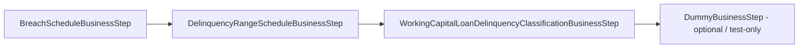
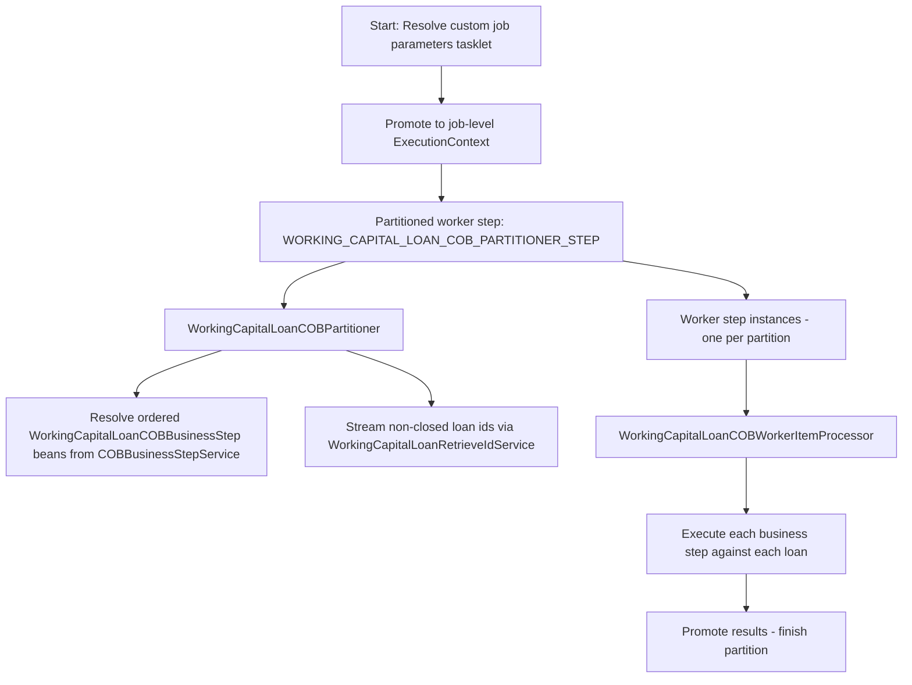
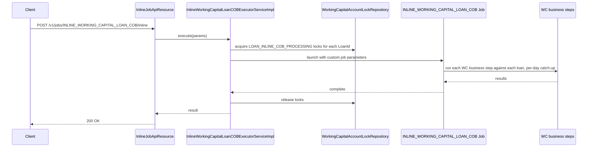

Working capital loans in Apache Fineract have their own Close-of-Business (COB) pipeline, separate from the classic `LOAN_COB_JOB` that handles progressive and declining-balance loans. The dedicated batch job — `WORKING_CAPITAL_LOAN_COB_JOB` — runs daily, partitions all non-closed `m_wc_loan` rows across worker steps, and executes an ordered chain of `WorkingCapitalLoanCOBBusinessStep` beans against each loan. Each business step is a small, single-responsibility component: generate the next breach period, generate the next delinquency period, classify into a delinquency range, or no-op (the `DummyBusinessStep` used for tests).

This page documents the steps themselves, how they hook into the surrounding Spring Batch infrastructure, and the catch-up route via the platform's inline COB executor.

## Where the steps live

All business steps for working capital loans live in a single package:

```
fineract-working-capital-loan/src/main/java/org/apache/fineract/cob/workingcapitalloan/businessstep/
├── WorkingCapitalLoanCOBBusinessStep.java                            # abstract base
├── BreachScheduleBusinessStep.java
├── DelinquencyRangeScheduleBusinessStep.java
├── WorkingCapitalLoanDelinquencyClassificationBusinessStep.java
└── DummyBusinessStep.java
```

The job/batch infrastructure that orchestrates them lives one package up at `cob/workingcapitalloan/` (partitioner, worker config, retrieve-id service, locks, custom job parameter tasklet).

## The base contract

```java title="fineract-working-capital-loan/src/main/java/org/apache/fineract/cob/workingcapitalloan/businessstep/WorkingCapitalLoanCOBBusinessStep.java"
package org.apache.fineract.cob.workingcapitalloan.businessstep;

import org.apache.fineract.cob.COBBusinessStep;
import org.apache.fineract.portfolio.workingcapitalloan.domain.WorkingCapitalLoan;

public abstract class WorkingCapitalLoanCOBBusinessStep implements COBBusinessStep<WorkingCapitalLoan> {}
```

`COBBusinessStep<T>` is the generic Fineract contract from `fineract-cob` — it requires a `T execute(T input)` method that returns the (possibly mutated) input, plus `getEnumStyledName()` and `getHumanReadableName()` for ordering and reporting. By parameterising it on `WorkingCapitalLoan`, the abstract base lets the COB engine distinguish WC steps from classic loan steps in a typesafe way.

The `cobBusinessStepService.getCOBBusinessSteps(WorkingCapitalLoanCOBBusinessStep.class, ...)` call in the partitioner filters discovered steps by this base class.

## `BreachScheduleBusinessStep`

The first step generates and evaluates *breach periods* — the windows during which a borrower must meet a minimum payment, configured on the loan product via the `WorkingCapitalBreach` policy.

```java title="fineract-working-capital-loan/src/main/java/org/apache/fineract/cob/workingcapitalloan/businessstep/BreachScheduleBusinessStep.java"
@Slf4j
@RequiredArgsConstructor
@Component
public class BreachScheduleBusinessStep extends WorkingCapitalLoanCOBBusinessStep {

    private final WorkingCapitalLoanBreachScheduleService breachScheduleService;

    @Override
    public WorkingCapitalLoan execute(final WorkingCapitalLoan input) {
        final boolean isDisbursed = input.getDisbursementDetails().stream()
                .map(WorkingCapitalLoanDisbursementDetails::getActualDisbursementDate).anyMatch(Objects::nonNull);
        if (!isDisbursed) {
            log.debug("Skipping breach schedule for WC loan {} - not yet disbursed", input.getId());
            return input;
        }

        final WorkingCapitalLoanProductRelatedDetails details = input.getLoanProductRelatedDetails();
        if (details == null || details.getBreach() == null) {
            log.debug("Skipping breach schedule for WC loan {} - no breach configuration", input.getId());
            return input;
        }

        final LocalDate businessDate = DateUtils.getBusinessLocalDate();

        if (!breachScheduleService.hasSchedule(input.getId())) {
            breachScheduleService.generateInitialPeriod(input);
        }

        breachScheduleService.generateNextPeriodIfNeeded(input, businessDate);
        breachScheduleService.evaluateBreachAndNearBreach(input, businessDate.plusDays(1L));

        return input;
    }

    @Override
    public String getEnumStyledName() {
        return "WC_BREACH_SCHEDULE";
    }

    @Override
    public String getHumanReadableName() {
        return "WC Breach Schedule";
    }
}
```

Two early returns short-circuit the work:

1. **Not yet disbursed.** Walks `disbursementDetails` looking for any actual disbursement date. If none, the loan hasn't entered its active life — nothing to evaluate.
2. **No breach configuration.** The product can opt out by leaving `WorkingCapitalLoanProductRelatedDetails.breach` null.

When both checks pass, the step calls three service methods in order:

| Call | Effect |
| --- | --- |
| `hasSchedule(loanId)` → `generateInitialPeriod(loan)` | Creates `m_wc_loan_breach_schedule` row #1 if missing. |
| `generateNextPeriodIfNeeded(loan, businessDate)` | If the *current* business day is past the end of the latest period, append the next one. |
| `evaluateBreachAndNearBreach(loan, businessDate.plusDays(1L))` | Look at *tomorrow*'s state to set `near_breach` and `breach` flags accordingly. |

The `businessDate.plusDays(1L)` argument is deliberate: COB is the close of *today*, so the evaluation horizon is tomorrow's opening. A breach detected at COB means the borrower has run out of road for the current period.

The enum-styled name `WC_BREACH_SCHEDULE` and human-readable `WC Breach Schedule` are what the COB ordering configuration uses — they appear in `m_batch_business_step` and in the operator UI ordering view.

## `DelinquencyRangeScheduleBusinessStep`

A sibling step for the *delinquency range schedule* — the per-period rows that track expected vs paid vs outstanding and classify days-delinquent:

```java title="fineract-working-capital-loan/src/main/java/org/apache/fineract/cob/workingcapitalloan/businessstep/DelinquencyRangeScheduleBusinessStep.java"
@Slf4j
@RequiredArgsConstructor
@Component
public class DelinquencyRangeScheduleBusinessStep extends WorkingCapitalLoanCOBBusinessStep {

    private final WorkingCapitalLoanDelinquencyRangeScheduleService rangeScheduleService;

    @Override
    public WorkingCapitalLoan execute(WorkingCapitalLoan input) {
        boolean isDisbursed = input.getDisbursementDetails().stream().map(WorkingCapitalLoanDisbursementDetails::getActualDisbursementDate)
                .anyMatch(Objects::nonNull);
        if (!isDisbursed) {
            log.debug("Skipping delinquency range schedule for WC loan {} - not yet disbursed", input.getId());
            return input;
        }

        LocalDate businessDate = DateUtils.getBusinessLocalDate();

        if (!rangeScheduleService.hasSchedule(input.getId())) {
            rangeScheduleService.generateInitialPeriod(input);
        }

        rangeScheduleService.generateNextPeriodIfNeeded(input, businessDate);
        rangeScheduleService.evaluateExpiredPeriods(input, businessDate);

        return input;
    }

    @Override
    public String getEnumStyledName() {
        return "WC_DELINQUENCY_RANGE_SCHEDULE";
    }

    @Override
    public String getHumanReadableName() {
        return "WC Delinquency Range Schedule";
    }
}
```

Same skip-if-not-disbursed gate; same three-call pattern:

| Call | Effect |
| --- | --- |
| `hasSchedule(loanId)` → `generateInitialPeriod(loan)` | Bootstrap the first `m_wc_loan_delinquency_range_schedule` row. |
| `generateNextPeriodIfNeeded(loan, businessDate)` | Roll to next period when today is past `to_date`. |
| `evaluateExpiredPeriods(loan, businessDate)` | For every period whose `to_date < businessDate`, mark `min_payment_criteria_met`, accumulate `delinquent_days`, and stamp `delinquent_amount`. |

Note the *different* date semantics from the breach step — delinquency evaluation looks at *today* (not tomorrow). The breach step is forward-looking ("will the borrower fail the upcoming window?"), the delinquency step is backward-looking ("which of yesterday's periods has now closed unpaid?").

## `WorkingCapitalLoanDelinquencyClassificationBusinessStep`

Once the range schedule has been refreshed by the previous step, the classification step writes the `DelinquencyRange` tag onto the loan's tag history:

```java title="fineract-working-capital-loan/src/main/java/org/apache/fineract/cob/workingcapitalloan/businessstep/WorkingCapitalLoanDelinquencyClassificationBusinessStep.java"
@Slf4j
@RequiredArgsConstructor
@Component
public class WorkingCapitalLoanDelinquencyClassificationBusinessStep extends WorkingCapitalLoanCOBBusinessStep {

    private final WorkingCapitalLoanDelinquencyClassificationService delinquencyClassificationService;

    @Override
    public WorkingCapitalLoan execute(WorkingCapitalLoan loan) {
        if (loan == null) {
            log.debug("Ignoring Working Capital delinquency tag processing for null loan.");
            return null;
        }
        String externalId = Optional.ofNullable(loan.getExternalId()).map(ExternalId::getValue).orElse(null);
        measure(() -> setDelinquencyBucketTags(loan, externalId), duration -> {
            log.debug(
                    "Ending Working Capital delinquency tag processing for loan with Id [{}], account number [{}], external Id [{}], finished in [{}]ms",
                    loan.getId(), loan.getAccountNumber(), externalId, duration.toMillis());
        });
        return loan;
    }
```

The `measure(...)` call from `org.apache.fineract.infrastructure.core.diagnostics.performance.MeasuringUtil` wraps the work in a stopwatch and logs the duration once finished — useful for COB tuning across thousands of loans.

The body delegates:

```java
public void setDelinquencyBucketTags(WorkingCapitalLoan loan, String externalId) {
    try {
        ...
        if (loan.getLoanProductRelatedDetails() != null && loan.getLoanProductRelatedDetails().getDelinquencyBucket() != null) {
            log.debug("Evaluate {} Working Capital Delinquency bucket", loan.getLoanProductRelatedDetails().getDelinquencyBucket());
            delinquencyClassificationService.classifyDelinquency(loan, ThreadLocalContextUtil.getBusinessDate().plusDays(1),
                    loan.getLoanProductRelatedDetails().getDelinquencyBucket());
        } else {
            log.debug("Skipping... Delinquency bucket is not configured for Working Capital Loan {}.", loan.getId());
        }
    } catch (RuntimeException re) {
        log.error(
                "Received exception while processing delinquency tag for Working Capital Loan with Id [{}], account number [{}], external Id [{}]",
                loan.getId(), loan.getAccountNumber(), externalId, re);

        throw re;
    }
}
```

Three things worth noting:

- The bucket configuration comes from the *loan's embedded product details*, not the live `WorkingCapitalLoanProduct`. This is consistent with the rest of the module — the product configuration is captured at submittal.
- `classifyDelinquency` is called with `businessDate.plusDays(1)` — same forward-looking horizon as the breach step.
- Any `RuntimeException` is *re-thrown* after logging — the worker step catches it and either retries or marks the partition as failed, depending on the surrounding configuration.

Names:

```java
@Override public String getEnumStyledName()    { return "WC_LOAN_DELINQUENCY_CLASSIFICATION"; }
@Override public String getHumanReadableName() { return "Working Capital Loan Delinquency Classification Business Step"; }
```

## `DummyBusinessStep`

A no-op step kept in production source so integration tests can verify ordering without touching the real services:

```java title="fineract-working-capital-loan/src/main/java/org/apache/fineract/cob/workingcapitalloan/businessstep/DummyBusinessStep.java"
@Slf4j
@RequiredArgsConstructor
@Component
public class DummyBusinessStep extends WorkingCapitalLoanCOBBusinessStep {

    @Override
    public WorkingCapitalLoan execute(WorkingCapitalLoan input) {
        log.info("Executing DummyBusinessStep... WorkingCapitalLoan ID = {}", input.getId());
        return input;
    }

    @Override
    public String getEnumStyledName() {
        return "DUMMY_BUSINESS_STEP";
    }

    @Override
    public String getHumanReadableName() {
        return "Dummy Business Step";
    }
}
```

In tenant configuration the step is typically disabled (left out of `m_batch_business_step`); enabling it adds a measurable log line per loan and is useful for verifying the pipeline is alive.

## Recommended order

Although the actual order is configured per-tenant via `m_batch_business_step`, the steps make most sense run in this sequence:



Reasoning:

1. **Breach** first — it doesn't depend on the delinquency tables.
2. **Delinquency range** second — generates the rows the classification needs.
3. **Classification** third — reads the rows and writes tag history.
4. **Dummy** last — harmless no-op.

## The job: `WORKING_CAPITAL_LOAN_COB_JOB`

The Spring Batch job is declared in `cob/workingcapitalloan/WorkingCapitalLoanCOBManagerConfiguration.java`:

```java title="fineract-working-capital-loan/src/main/java/org/apache/fineract/cob/workingcapitalloan/WorkingCapitalLoanCOBManagerConfiguration.java"
import static org.apache.fineract.infrastructure.jobs.service.JobName.WORKING_CAPITAL_LOAN_COB_JOB;

@Configuration
@EnableBatchIntegration
@Conditional(BatchManagerCondition.class)
@RequiredArgsConstructor
public class WorkingCapitalLoanCOBManagerConfiguration {

    @Bean(WORKING_CAPITAL_JOB_HUMAN_READABLE_NAME)
    public Job workingCapitalLoanCOBJob(WorkingCapitalLoanCOBPartitioner workingCapitalLoanCOBPartitioner,
            ExecutionContextPromotionListener customJobParametersPromotionListener) {
        return new JobBuilder(WORKING_CAPITAL_LOAN_COB_JOB.name(), jobRepository)
                .start(resolveCustomJobParametersForWorkingCapitalStep(customJobParametersPromotionListener))
                .next(workingCapitalLoanCOBStep(workingCapitalLoanCOBPartitioner)).incrementer(new RunIdIncrementer()) //
                .build();
    }
```

The `JobName` enum entry for the job is defined in `fineract-core`:

```java title="fineract-core/src/main/java/org/apache/fineract/infrastructure/jobs/service/JobName.java"
WORKING_CAPITAL_LOAN_COB_JOB("Working Capital Loan COB"),
```

So `WORKING_CAPITAL_LOAN_COB_JOB.name()` resolves to the string `"WORKING_CAPITAL_LOAN_COB_JOB"` — that's the identifier you pass to the inline-job endpoint to trigger a manual run.

### Job shape



### Constants

```java title="fineract-working-capital-loan/src/main/java/org/apache/fineract/cob/workingcapitalloan/WorkingCapitalLoanCOBConstant.java"
public final class WorkingCapitalLoanCOBConstant extends COBConstant {

    public static final String WORKING_CAPITAL_JOB_NAME = "WC_LOAN_COB";
    public static final String WORKING_CAPITAL_JOB_HUMAN_READABLE_NAME = "Working Capital Loan COB";
    public static final String WORKING_CAPITAL_LOAN_COB_JOB_NAME = "WORKING_CAPITAL_LOAN_CLOSE_OF_BUSINESS";

    public static final String WORKING_CAPITAL_LOAN_COB_STEP = "workingCapitalLoanCOBStep";
    public static final String WORKING_CAPITAL_LOAN_COB_BUSINESS_STEP = "workingCapitalLoanCOBBusinessStep";
    public static final String WORKING_CAPITAL_LOAN_COB_PARTITIONER = "workingCapitalLoanCOBPartitioner";

    public static final String WORKING_CAPITAL_LOAN_COB_WORKER_STEP = "workingCapitalLoanCOBWorkerStep";
    public static final String WORKING_CAPITAL_LOAN_COB_FLOW = "workingCapitalLoanCOBFlow";

    public static final String INLINE_WORKING_CAPITAL_LOAN_COB_JOB_NAME = "INLINE_WORKING_CAPITAL_LOAN_COB";
    public static final String WORKING_CAPITAL_LOAN_IDS_PARAMETER_NAME = "LoanIds";

    public static final String WORKING_CAPITAL_LOAN_COB_PARTITIONER_STEP = "Working Capital Loan COB partition - Step";
}
```

Three names to remember:

| Constant | Value | Used as |
| --- | --- | --- |
| `WORKING_CAPITAL_LOAN_COB_JOB_NAME` | `"WORKING_CAPITAL_LOAN_CLOSE_OF_BUSINESS"` | Identifier passed to `cobBusinessStepService.getCOBBusinessSteps(...)` to scope the ordering query. |
| `INLINE_WORKING_CAPITAL_LOAN_COB_JOB_NAME` | `"INLINE_WORKING_CAPITAL_LOAN_COB"` | Identifier for the inline / catch-up variant launched via the platform inline-job API. |
| `WORKING_CAPITAL_LOAN_IDS_PARAMETER_NAME` | `"LoanIds"` | JSON parameter name accepted by the inline executor (which loans to catch up). |

## Partitioning: `WorkingCapitalLoanCOBPartitioner`

```java title="fineract-working-capital-loan/src/main/java/org/apache/fineract/cob/workingcapitalloan/WorkingCapitalLoanCOBPartitioner.java"
public Map<String, ExecutionContext> partition(int gridSize) {
    int partitionSize = propertyService.getPartitionSize(WORKING_CAPITAL_JOB_NAME);
    Set<BusinessStepNameAndOrder> cobBusinessSteps = cobBusinessStepService.getCOBBusinessSteps(WorkingCapitalLoanCOBBusinessStep.class,
            WORKING_CAPITAL_LOAN_COB_JOB_NAME);
    return getPartitions(partitionSize, cobBusinessSteps);
}
```

Two key facts:

- The partition size is *configurable per job* via `PropertyService.getPartitionSize("WC_LOAN_COB")`. Tenants with large WC portfolios bump it up so each worker handles fewer loans.
- The ordered business step set is fetched from `COBBusinessStepService` — the same service used by the classic `LOAN_COB_JOB`, just with a different class filter (`WorkingCapitalLoanCOBBusinessStep.class`).

## Retrieving the loan ids

`WorkingCapitalLoanRetrieveIdService` walks non-closed loan statuses to find the candidates:

```java title="fineract-working-capital-loan/src/main/java/org/apache/fineract/cob/workingcapitalloan/WorkingCapitalLoanRetrieveIdServiceImpl.java"
private static final Collection<LoanStatus> NON_CLOSED_LOAN_STATUSES = new ArrayList<>(
        Arrays.asList(LoanStatus.SUBMITTED_AND_PENDING_APPROVAL, LoanStatus.APPROVED, LoanStatus.ACTIVE,
                LoanStatus.TRANSFER_IN_PROGRESS, LoanStatus.TRANSFER_ON_HOLD));
```

So the daily COB run looks at every WC loan in:

- `SUBMITTED_AND_PENDING_APPROVAL` — the partitioner still picks it up because the *business steps themselves* short-circuit on undisbursed loans (see the `isDisbursed` checks above).
- `APPROVED` — same; partitioned, but business steps skip until disbursement.
- `ACTIVE` — the bulk of real work.
- `TRANSFER_IN_PROGRESS` / `TRANSFER_ON_HOLD` — picked up because COB still has to track delinquency on transferring loans.

`REJECTED`, `WITHDRAWN`, `CLOSED_OBLIGATIONS_MET`, `OVERPAID`, `CLOSED_WRITTEN_OFF` etc. are excluded entirely.

## Locking and the inline catch-up path

For partition workers and inline runs alike, the engine takes per-loan locks to avoid double-processing:

- The lock entity is `WorkingCapitalLoanAccountLock` (under `cob/domain/`), persisted in `m_wc_loan_account_locks`.
- The lock owner enum is `LockOwner.LOAN_COB_CHUNK_PROCESSING` (chunk worker) or `LockOwner.LOAN_INLINE_COB_PROCESSING` (inline / catch-up).
- The custom lock query joins to the classic `m_loan_account_lock` table so a WC loan that already has an inline lock from the regular COB is left alone — see `CustomWorkingCapitalLoanAccountLockRepositoryImpl`:

```sql
and lck.lock_owner in ('LOAN_COB_CHUNK_PROCESSING','LOAN_INLINE_COB_PROCESSING')
```

The two lock owners are visible in the inline writer/listener too:

```java title="fineract-working-capital-loan/src/main/java/org/apache/fineract/cob/workingcapitalloan/InlineWorkingCapitalLoanCOBWorkerItemListener.java"
public class InlineWorkingCapitalLoanCOBWorkerItemListener extends AbstractLoanItemListener<WorkingCapitalLoanAccountLock, Loan> {
    ...
    return LockOwner.LOAN_INLINE_COB_PROCESSING;
```

```java title="fineract-working-capital-loan/src/main/java/org/apache/fineract/cob/workingcapitalloan/InlineWorkingCapitalLoanCOBWorkerItemWriter.java"
public class InlineWorkingCapitalLoanCOBWorkerItemWriter extends AbstractWorkingCapitalLoanCOBWorkerItemWriter {
    ...
    return LockOwner.LOAN_INLINE_COB_PROCESSING;
```

### Triggering catch-up via the inline-job endpoint

The platform exposes a generic inline-job endpoint at `/v1/jobs/{jobName}/inline` (under `fineract-provider`). To catch up a working capital loan that fell behind on COB days — for example because it was locked during chunk processing or because COB was paused — you POST to:

```
POST /v1/jobs/INLINE_WORKING_CAPITAL_LOAN_COB/inline
Content-Type: application/json

{
  "LoanIds": [12345, 12346]
}
```

The job name is `INLINE_WORKING_CAPITAL_LOAN_COB` (from `WorkingCapitalLoanCOBConstant.INLINE_WORKING_CAPITAL_LOAN_COB_JOB_NAME`). The parameter `LoanIds` (constant `WORKING_CAPITAL_LOAN_IDS_PARAMETER_NAME`) carries the list to catch up.

On the server side, `InlineWorkingCapitalLoanCOBExecutorServiceImpl` (in `fineract-provider`) handles the request. It extends the shared `InlineCommonLockableCOBExecutorService<WorkingCapitalLoanAccountLock>` so the lock-management and partition-launch logic are factored once:

```java title="fineract-provider/src/main/java/org/apache/fineract/cob/service/InlineWorkingCapitalLoanCOBExecutorServiceImpl.java"
@Service
@Slf4j
@Conditional(LoanCOBEnabledCondition.class)
public class InlineWorkingCapitalLoanCOBExecutorServiceImpl extends InlineCommonLockableCOBExecutorService<WorkingCapitalLoanAccountLock> {

    public InlineWorkingCapitalLoanCOBExecutorServiceImpl(WorkingCapitalAccountLockRepository loanAccountLockRepository,
            InlineLoanCOBExecutionDataParser dataParser, JobLauncher jobLauncher, JobLocator jobLocator, JobExplorer jobExplorer,
            TransactionTemplate transactionTemplate, CustomJobParameterRepository customJobParameterRepository,
            PlatformSecurityContext context, WorkingCapitalLoanRetrieveIdService retrieveIdService, FineractProperties fineractProperties) {
        super(loanAccountLockRepository, dataParser, jobLauncher, jobLocator, jobExplorer, transactionTemplate,
                customJobParameterRepository, context, retrieveIdService, fineractProperties);
    }
```

The flow:



The same business steps run on the inline path as on the daily batch — the only difference is how the loans are selected and how the locks are owned.

## Adding a step

A new step lives or dies by three things:

1. **Inherits the base.** It must extend `WorkingCapitalLoanCOBBusinessStep` so the partitioner picks it up.
2. **Is a `@Component`.** Standard Spring discovery.
3. **Has a unique `getEnumStyledName()`.** That value lives in `m_batch_business_step` (the per-tenant ordering table) and is keyed unique per job.

Adding the row to `m_batch_business_step` activates the step in the chain. The COB pipeline will then execute it in the configured order — no other code change is needed.

## Where to read next

- [Domain and Product](/working-capital-loan/domain-and-product) — the entities the steps read and write (`m_wc_loan_breach_schedule`, `m_wc_loan_delinquency_range_schedule`, `m_wc_loan_range_delinquency_tag`).
- [Calc and Schedule](/working-capital-loan/calc-and-schedule) — the projection that the steps consume.
- [API and Handlers](/working-capital-loan/api-and-handlers) — the synchronous read endpoints that surface the COB outputs (`/breach-schedule`, `/delinquency-range-schedule`).
