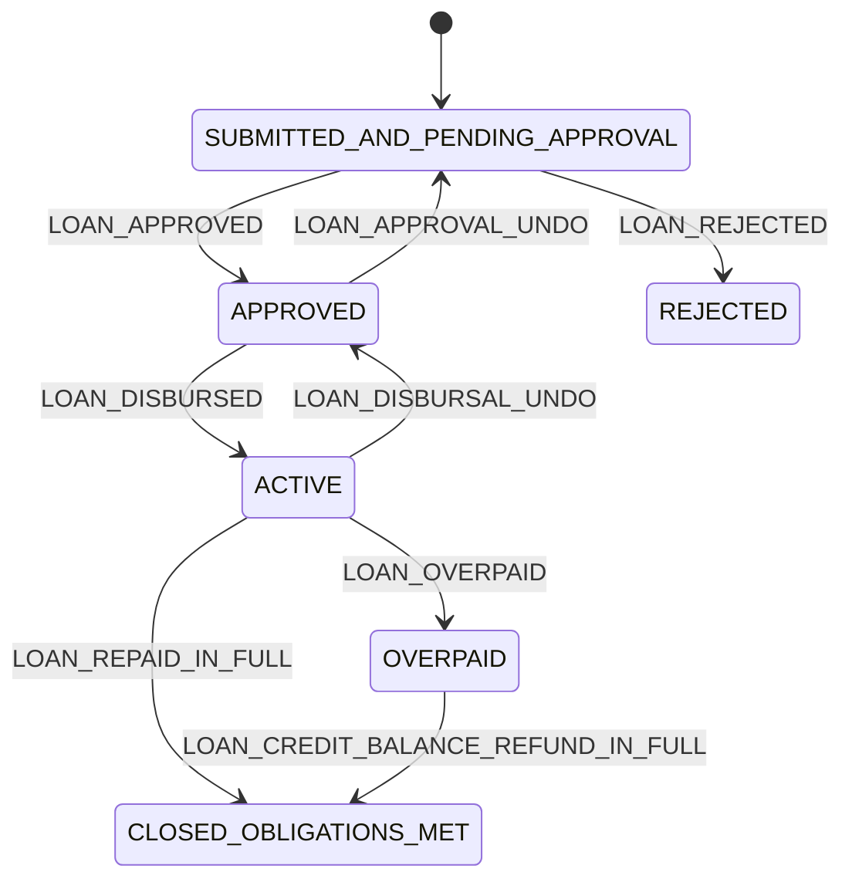
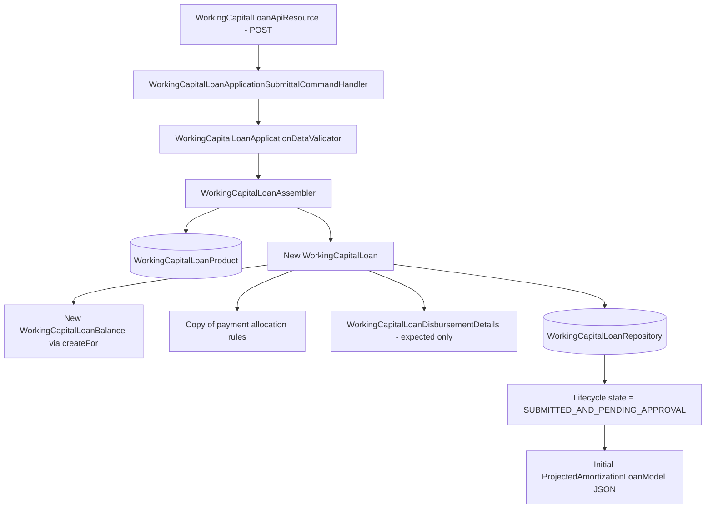

The Apache Fineract `fineract-working-capital-loan` module keeps its own persistence world. None of the classes documented here extend or inherit from the classic `fineract-loan` aggregate — they reuse a handful of low-level value objects (`LoanStatus`, `LoanTransactionType`, `ExternalId`, `MonetaryCurrency`, `DelinquencyBucket`, `PaymentDetail`) but model the loan, its balance, transactions, schedules, and delinquency state as fully independent entities mapped to a parallel `m_wc_*` schema.

This page is the domain reference: every JPA entity in `portfolio/workingcapitalloan/domain/`, the matching Spring Data repository under `repository/`, the JSON validators under `serialization/` and `validator/`, and the typed exceptions under `exception/`. It also covers how a `WorkingCapitalLoanProduct` parameterises a loan instance, so the product surface is consistent with the loan entity that references it.

## The two schema families

There are two parallel tables of tables — *product* on one side, *loan instance* on the other:

```
fineract-working-capital-loan/src/main/java/org/apache/fineract/portfolio/
├── workingcapitalloanproduct/      # product family (m_wc_loan_product*)
│   └── domain/
│       ├── WorkingCapitalLoanProduct
│       ├── WorkingCapitalLoanProductRelatedDetail / RelatedDetails
│       ├── WorkingCapitalLoanProductMinMaxConstraints
│       ├── WorkingCapitalLoanProductConfigurableAttributes
│       ├── WorkingCapitalLoanProductPaymentAllocationRule
│       └── WorkingCapitalAccountingRuleType
└── workingcapitalloan/             # loan-instance family (m_wc_loan*)
    ├── domain/                     # documented here
    ├── repository/                 # documented here
    ├── serialization/              # documented here
    ├── validator/                  # documented here
    └── exception/                  # documented here
```

The product entities live under `workingcapitalloanproduct/domain/` — a sibling package, not a sub-package. The loan entities live under `workingcapitalloan/domain/` and reference the product via a lazy `@ManyToOne` plus an embedded `WorkingCapitalLoanProductRelatedDetails` copy (so a product change does not retroactively reshape an in-flight loan).

## ER overview

```mermaid
erDiagram
    WorkingCapitalLoan ||--o| WorkingCapitalLoanBalance : "1:1 (balance)"
    WorkingCapitalLoan ||--o{ WorkingCapitalLoanDisbursementDetails : "1:N (disbursements)"
    WorkingCapitalLoan ||--o{ WorkingCapitalLoanTransaction : "1:N (transactions)"
    WorkingCapitalLoanTransaction ||--o| WorkingCapitalLoanTransactionAllocation : "1:1"
    WorkingCapitalLoanTransaction ||--o{ WorkingCapitalLoanTransactionRelation : "from/to graph"
    WorkingCapitalLoan ||--o{ WorkingCapitalLoanPaymentAllocationRule : "1:N (per txn type)"
    WorkingCapitalLoan ||--o{ WorkingCapitalLoanBreachSchedule : "1:N (period rows)"
    WorkingCapitalLoan ||--o{ WorkingCapitalLoanDelinquencyRangeSchedule : "1:N"
    WorkingCapitalLoanDelinquencyRangeSchedule ||--o{ WorkingCapitalLoanDelinquencyRangeScheduleTagHistory : "tag history"
    WorkingCapitalLoan ||--o{ WorkingCapitalLoanDelinquencyAction : "pause/resume actions"
    WorkingCapitalLoan ||--o{ WorkingCapitalLoanPeriodPaymentRateChange : "rate-change events"
    WorkingCapitalLoan ||--o{ WorkingCapitalLoanNote : "free-text notes"
    WorkingCapitalLoan ||--o| ProjectedAmortizationLoanModel : "1:1 (JSON model)"
    WorkingCapitalLoan }o--|| WorkingCapitalLoanProduct : "M:1 (product)"
    WorkingCapitalLoan }o--|| Client : "M:1 (borrower)"
```



## The aggregate root: `WorkingCapitalLoan`

`fineract-working-capital-loan/src/main/java/org/apache/fineract/portfolio/workingcapitalloan/domain/WorkingCapitalLoan.java` is the aggregate root. It extends `AbstractAuditableWithUTCDateTimeCustom<Long>` from `fineract-core` for `createdBy`, `createdDate`, `lastModifiedBy`, `lastModifiedDate` — all UTC.

```java title="fineract-working-capital-loan/src/main/java/org/apache/fineract/portfolio/workingcapitalloan/domain/WorkingCapitalLoan.java"
@Entity
@Table(name = "m_wc_loan", uniqueConstraints = { @UniqueConstraint(columnNames = { "account_no" }, name = "wc_loan_account_no_UNIQUE"),
        @UniqueConstraint(columnNames = { "external_id" }, name = "wc_loan_externalid_UNIQUE") })
@Getter
public class WorkingCapitalLoan extends AbstractAuditableWithUTCDateTimeCustom<Long> {

    @Version
    int version;

    @Setter
    @Column(name = "last_closed_business_date")
    private LocalDate lastClosedBusinessDate;
    ...
}
```

### Identity & external references

| Column | Field | Notes |
| --- | --- | --- |
| `id` (inherited) | `id` | Surrogate PK. |
| `account_no` | `accountNumber` | Unique, length 20, generated. |
| `external_id` | `externalId` | Unique, optional `ExternalId` value object. |
| `version` | `version` | JPA `@Version` for optimistic locking. |

### Relationships (lazy by default)

```java
@Setter
@ManyToOne
@JoinColumn(name = "client_id")
private Client client;

@Setter
@ManyToOne(fetch = FetchType.EAGER)
@JoinColumn(name = "fund_id")
private Fund fund;

@Setter
@ManyToOne(fetch = FetchType.LAZY)
@JoinColumn(name = "product_id", nullable = false)
private WorkingCapitalLoanProduct loanProduct;
```

Note `fund` is eager (it's small and almost always needed), `loanProduct` is lazy.

### Lifecycle dates and actors

For every state transition the loan stores both the *date* and the *user*:

| Date column | User column |
| --- | --- |
| `submittedon_date` | (audited via base class) |
| `rejectedon_date` | `rejectedon_userid` → `AppUser rejectedBy` |
| `approvedon_date` | `approvedon_userid` → `AppUser approvedBy` |
| `closedon_date` | `closedon_userid` → `AppUser closedBy` |
| `expected_maturedon_date` | — |
| `maturedon_date` | — (set on full pay) |

### Amounts and counters

```java
@Setter
@Column(name = "principal_amount_proposed", scale = 6, precision = 19, nullable = false)
private BigDecimal proposedPrincipal;

@Setter
@Column(name = "approved_principal", scale = 6, precision = 19, nullable = false)
private BigDecimal approvedPrincipal;

@Setter
@Column(name = "loan_counter")
private Integer loanCounter;            // per client

@Setter
@Column(name = "loan_product_counter")
private Integer loanProductCounter;     // per (client, product) — used as loan cycle
```

Precision `19,6` matches Fineract's standard for principal-bearing money columns.

### Embedded product detail

```java
@Setter
@Embedded
private WorkingCapitalLoanProductRelatedDetails loanProductRelatedDetails;
```

`WorkingCapitalLoanProductRelatedDetails` is `@Embeddable` and lives in `workingcapitalloanproduct/domain/`. Its columns sit *inside* the `m_wc_loan` row. This is a deliberate copy: the loan captures the product settings *at submission* so subsequent product edits don't change in-flight contracts.

### Child collections

```java
@Setter
@OneToOne(mappedBy = "wcLoan", cascade = CascadeType.ALL, orphanRemoval = true)
private WorkingCapitalLoanBalance balance;

@OneToMany(cascade = CascadeType.ALL, mappedBy = "wcLoan", orphanRemoval = true, fetch = FetchType.LAZY)
private List<WorkingCapitalLoanPaymentAllocationRule> paymentAllocationRules = new ArrayList<>();

@OneToMany(cascade = CascadeType.ALL, mappedBy = "wcLoan", orphanRemoval = true, fetch = FetchType.LAZY)
private List<WorkingCapitalLoanDisbursementDetails> disbursementDetails = new ArrayList<>();

@OrderBy(value = "transactionDate, createdDate, id")
@OneToMany(cascade = CascadeType.ALL, mappedBy = "wcLoan", orphanRemoval = true, fetch = FetchType.LAZY)
private List<WorkingCapitalLoanTransaction> transactions = new ArrayList<>();
```

Two convenience accessors paper over the `client`/`office` nullable chain:

```java
public Long getOfficeId() {
    return client != null && client.getOffice() != null ? client.getOffice().getId() : null;
}

public Long getClientId() {
    return client != null ? client.getId() : null;
}
```

## `WorkingCapitalLoanBalance` — the singleton balance row

Each loan owns exactly one balance row. The balance is updated from allocations and is the source of truth for accounting posts:

```java title="fineract-working-capital-loan/src/main/java/org/apache/fineract/portfolio/workingcapitalloan/domain/WorkingCapitalLoanBalance.java"
@Entity
@Table(name = "m_wc_loan_balance", uniqueConstraints = {
        @UniqueConstraint(columnNames = { "wc_loan_id" }, name = "uq_m_wc_loan_balance_loan_id") })
@Getter
public class WorkingCapitalLoanBalance extends AbstractAuditableWithUTCDateTimeCustom<Long> {

    @OneToOne(optional = false, fetch = FetchType.LAZY)
    @JoinColumn(name = "wc_loan_id", nullable = false, unique = true)
    private WorkingCapitalLoan wcLoan;

    @Column(name = "principal_outstanding", scale = 6, precision = 19, nullable = false)
    @Setter
    private BigDecimal principalOutstanding = BigDecimal.ZERO;

    @Column(name = "total_paid_principal", scale = 6, precision = 19, nullable = false)
    @Setter
    private BigDecimal totalPaidPrincipal = BigDecimal.ZERO;

    @Column(name = "total_payment", scale = 6, precision = 19, nullable = false)
    @Setter
    private BigDecimal totalPayment = BigDecimal.ZERO;

    @Column(name = "realized_income", scale = 6, precision = 19, nullable = false)
    @Setter
    private BigDecimal realizedIncome = BigDecimal.ZERO;

    @Column(name = "unrealized_income", scale = 6, precision = 19, nullable = false)
    @Setter
    private BigDecimal unrealizedIncome = BigDecimal.ZERO;

    @Column(name = "overpayment_amount", scale = 6, precision = 19, nullable = false)
    @Setter
    private BigDecimal overpaymentAmount = BigDecimal.ZERO;

    @Version
    @Column(name = "version")
    private Integer version;

    protected WorkingCapitalLoanBalance() {}

    public static WorkingCapitalLoanBalance createFor(final WorkingCapitalLoan loan) {
        final WorkingCapitalLoanBalance balance = new WorkingCapitalLoanBalance();
        balance.wcLoan = loan;
        return balance;
    }
}
```

The factory method `createFor` is used at submittal so the loan is never persisted without a balance row.

| Field | Meaning |
| --- | --- |
| `principalOutstanding` | Net principal that has been disbursed but not yet repaid. |
| `totalPaidPrincipal` | Sum of principal portions across all repayments. |
| `totalPayment` | Total cash received (principal + fees + penalties). |
| `realizedIncome` | Discount fee earned to date (recognised). |
| `unrealizedIncome` | Discount fee accrued but not yet recognised. |
| `overpaymentAmount` | Excess paid above outstanding — refunded via credit-balance-refund. |

## `WorkingCapitalLoanDisbursementDetails` — the planned tranches

A working capital loan can plan multiple tranches in a single application:

```java title="fineract-working-capital-loan/src/main/java/org/apache/fineract/portfolio/workingcapitalloan/domain/WorkingCapitalLoanDisbursementDetails.java"
@Getter
@Setter
@Entity
@Table(name = "m_wc_loan_disbursement_detail")
public class WorkingCapitalLoanDisbursementDetails extends AbstractPersistableCustom<Long> {

    @ManyToOne(fetch = FetchType.LAZY)
    @JoinColumn(name = "wc_loan_id", nullable = false)
    private WorkingCapitalLoan wcLoan;

    @Column(name = "expected_disburse_date")
    private LocalDate expectedDisbursementDate;

    @Column(name = "expected_amount", scale = 6, precision = 19)
    private BigDecimal expectedAmount;

    @Column(name = "expected_maturity_date")
    private LocalDate expectedMaturityDate;

    @Column(name = "actual_disburse_date")
    private LocalDate actualDisbursementDate;

    @Column(name = "actual_amount", scale = 6, precision = 19)
    private BigDecimal actualAmount;

    @ManyToOne(fetch = FetchType.LAZY)
    @JoinColumn(name = "disbursedon_userid")
    private AppUser disbursedBy;
}
```

Each row tracks an *expected* tuple (`expectedDisbursementDate`, `expectedAmount`, `expectedMaturityDate`) and an *actual* tuple (`actualDisbursementDate`, `actualAmount`, `disbursedBy`). Until the actual columns are set, the tranche is *planned but not yet drawn*. Setting them on a tranche triggers a model recompute — see [Calc and Schedule](/working-capital-loan/calc-and-schedule).

Note: this entity extends `AbstractPersistableCustom<Long>`, not the auditable base — disbursement details inherit timestamps from the parent loan.

## `WorkingCapitalLoanTransaction` — the journal of activity

Every cash event on the loan — disbursement, repayment, discount fee, credit-balance refund, goodwill credit — is a `WorkingCapitalLoanTransaction`:

```java title="fineract-working-capital-loan/src/main/java/org/apache/fineract/portfolio/workingcapitalloan/domain/WorkingCapitalLoanTransaction.java"
@Entity
@Table(name = "m_wc_loan_transaction", uniqueConstraints = {
        @UniqueConstraint(columnNames = { "external_id" }, name = "wc_loan_transaction_external_id_UNIQUE") })
@Getter
public class WorkingCapitalLoanTransaction extends AbstractAuditableWithUTCDateTimeCustom<Long> {

    @ManyToOne(optional = false, fetch = FetchType.LAZY)
    @JoinColumn(name = "wc_loan_id", nullable = false)
    private WorkingCapitalLoan wcLoan;

    @Column(name = "transaction_type_id", nullable = false)
    @Convert(converter = LoanTransactionTypeConverter.class)
    private LoanTransactionType transactionType;
    ...
}
```

Static factories make the transaction type explicit:

```java
public static WorkingCapitalLoanTransaction disbursement(...) { ... LoanTransactionType.DISBURSEMENT ... }
public static WorkingCapitalLoanTransaction repayment(...) { ... LoanTransactionType.REPAYMENT ... }
public static WorkingCapitalLoanTransaction goodwillCredit(...) { ... LoanTransactionType.GOODWILL_CREDIT ... }
public static WorkingCapitalLoanTransaction creditBalanceRefund(...) { ... LoanTransactionType.CREDIT_BALANCE_REFUND ... }
public static WorkingCapitalLoanTransaction discountFee(...) { ... LoanTransactionType.DISCOUNT_FEE ... }
```

Each transaction owns a `WorkingCapitalLoanTransactionAllocation` (single row, 1:1) that decomposes the amount into principal/fee/penalty portions:

```java
@OneToOne(mappedBy = "wcLoanTransaction", cascade = CascadeType.ALL, orphanRemoval = true)
private WorkingCapitalLoanTransactionAllocation allocation;
```

Reversals are tracked by flag + audit columns:

```java
@Column(name = "is_reversed", nullable = false)
@Setter
private boolean reversed;

@Column(name = "reversal_external_id", length = 100, unique = true)
@Setter
private ExternalId reversalExternalId;

@Column(name = "reversed_on_date")
@Setter
private LocalDate reversedOnDate;
```

Transactions that *reverse* or *adjust* others are connected by `WorkingCapitalLoanTransactionRelation`:

```java title="fineract-working-capital-loan/src/main/java/org/apache/fineract/portfolio/workingcapitalloan/domain/WorkingCapitalLoanTransactionRelation.java"
@Entity
@Table(name = "m_wc_loan_transaction_relation")
public class WorkingCapitalLoanTransactionRelation extends AbstractAuditableWithUTCDateTimeCustom<Long> {

    @ManyToOne
    @JoinColumn(name = "from_loan_transaction_id", nullable = false)
    private WorkingCapitalLoanTransaction fromTransaction;

    @Setter
    @ManyToOne
    @JoinColumn(name = "to_loan_transaction_id")
    private WorkingCapitalLoanTransaction toTransaction;

    @Column(name = "relation_type_enum", nullable = false)
    @Convert(converter = LoanTransactionRelationTypeEnumConverter.class)
    private LoanTransactionRelationTypeEnum relationType;
    ...
}
```

## `WorkingCapitalLoanTransactionAllocation`

A 1:1 child of each transaction, holding the breakdown into principal/fee/penalty:

```java title="fineract-working-capital-loan/src/main/java/org/apache/fineract/portfolio/workingcapitalloan/domain/WorkingCapitalLoanTransactionAllocation.java"
@Entity
@Table(name = "m_wc_loan_transaction_allocation", uniqueConstraints = {
        @UniqueConstraint(columnNames = { "wc_loan_transaction_id" }, name = "uq_m_wc_loan_transaction_allocation_transaction_id") })
@Getter
public class WorkingCapitalLoanTransactionAllocation extends AbstractAuditableWithUTCDateTimeCustom<Long> {

    @OneToOne(optional = false, fetch = FetchType.LAZY)
    @JoinColumn(name = "wc_loan_transaction_id", nullable = false, unique = true)
    private WorkingCapitalLoanTransaction wcLoanTransaction;

    @Column(name = "principal_portion", scale = 6, precision = 19)
    @Setter
    private BigDecimal principalPortion;

    @Column(name = "fee_charges_portion", scale = 6, precision = 19)
    @Setter
    private BigDecimal feeChargesPortion;

    @Column(name = "penalty_charges_portion", scale = 6, precision = 19)
    @Setter
    private BigDecimal penaltyChargesPortion;
    ...
}
```

Static factories for the common cases:

```java
public static WorkingCapitalLoanTransactionAllocation forPrincipalAllocation(final WorkingCapitalLoanTransaction transaction,
        final BigDecimal principalAmount) { ... }

public static WorkingCapitalLoanTransactionAllocation forDisbursementDiscount(final WorkingCapitalLoanTransaction transaction,
        final BigDecimal principalAmount) { ... }
```

## `WorkingCapitalLoanPaymentAllocationRule` — per-loan waterfall

Each loan stores the *payment waterfall* — the order of buckets that a repayment fills first. The rule is keyed by `(loan, transactionType)`:

```java title="fineract-working-capital-loan/src/main/java/org/apache/fineract/portfolio/workingcapitalloan/domain/WorkingCapitalLoanPaymentAllocationRule.java"
@Entity
@Table(name = "m_wc_loan_payment_allocation_rule", uniqueConstraints = {
        @UniqueConstraint(columnNames = { "wc_loan_id", "transaction_type" }, name = "uq_m_wc_loan_payment_allocation_rule") })
public class WorkingCapitalLoanPaymentAllocationRule extends AbstractAuditableWithUTCDateTimeCustom<Long> {

    @ManyToOne
    @JoinColumn(name = "wc_loan_id", nullable = false)
    private WorkingCapitalLoan wcLoan;

    @Column(name = "transaction_type", nullable = false)
    @Enumerated(EnumType.STRING)
    private PaymentAllocationTransactionType transactionType;

    @Convert(converter = WorkingCapitalPaymentAllocationTypeListConverter.class)
    @Column(name = "allocation_types", nullable = false)
    private List<WorkingCapitalPaymentAllocationType> allocationTypes;
}
```

The `allocation_types` column is a single text field that the converter splits into an ordered list (e.g. `PENALTY,FEE,PRINCIPAL`). At loan submittal the rule list is copied from the product; the loan then has its own independent waterfall.

## Breach schedule

`WorkingCapitalLoanBreachSchedule` rows are generated by COB and represent the *minimum-payment buckets* that the borrower must meet within each period:

```java title="fineract-working-capital-loan/src/main/java/org/apache/fineract/portfolio/workingcapitalloan/domain/WorkingCapitalLoanBreachSchedule.java"
@Entity
@Table(name = "m_wc_loan_breach_schedule", uniqueConstraints = {
        @UniqueConstraint(columnNames = { "wc_loan_id", "period_number" }, name = "uc_wc_breach_schedule_loan_period") })
public class WorkingCapitalLoanBreachSchedule extends AbstractAuditableWithUTCDateTimeCustom<Long> {

    @ManyToOne(fetch = FetchType.LAZY) @JoinColumn(name = "wc_loan_id", nullable = false) private WorkingCapitalLoan loan;

    @Column(name = "period_number", nullable = false) private Integer periodNumber;
    @Column(name = "from_date", nullable = false)    private LocalDate fromDate;
    @Column(name = "to_date", nullable = false)      private LocalDate toDate;
    @Column(name = "number_of_days")                 private Integer numberOfDays;
    @Column(name = "min_payment_amount", scale = 6, precision = 19) private BigDecimal minPaymentAmount;
    @Column(name = "paid_amount", scale = 6, precision = 19)        private BigDecimal paidAmount;
    @Column(name = "outstanding_amount", scale = 6, precision = 19) private BigDecimal outstandingAmount;
    @Column(name = "near_breach") private Boolean nearBreach;
    @Column(name = "breach")      private Boolean breach;
}
```

The unique key `(wc_loan_id, period_number)` prevents duplicate periods. The COB step `BreachScheduleBusinessStep` evaluates `paid_amount` against `min_payment_amount` once per business day — see [COB business steps](/working-capital-loan/cob-business-steps).

## Delinquency: range schedule, tag history, and actions

The delinquency story has three entities.

### `WorkingCapitalLoanDelinquencyRangeSchedule`

```java title="fineract-working-capital-loan/src/main/java/org/apache/fineract/portfolio/workingcapitalloan/domain/WorkingCapitalLoanDelinquencyRangeSchedule.java"
@Entity
@Table(name = "m_wc_loan_delinquency_range_schedule", uniqueConstraints = {
        @UniqueConstraint(columnNames = { "wc_loan_id", "period_number" }, name = "uc_wc_delinquency_range_schedule_loan_period") })
public class WorkingCapitalLoanDelinquencyRangeSchedule extends AbstractAuditableWithUTCDateTimeCustom<Long> {

    @Version @Column(name = "version") private Integer version;

    @ManyToOne(fetch = FetchType.LAZY) @JoinColumn(name = "wc_loan_id", nullable = false) private WorkingCapitalLoan loan;

    @Column(name = "period_number", nullable = false) private Integer periodNumber;
    @Column(name = "from_date", nullable = false)    private LocalDate fromDate;
    @Column(name = "to_date", nullable = false)      private LocalDate toDate;
    @Column(name = "expected_amount", scale = 6, precision = 19)    private BigDecimal expectedAmount;
    @Column(name = "paid_amount", scale = 6, precision = 19)        private BigDecimal paidAmount;
    @Column(name = "outstanding_amount", scale = 6, precision = 19) private BigDecimal outstandingAmount;
    @Column(name = "min_payment_criteria_met") private Boolean minPaymentCriteriaMet;
    @Column(name = "delinquent_days")          private Long delinquentDays;
    @Column(name = "delinquent_amount", scale = 6, precision = 19) private BigDecimal delinquentAmount;
}
```

One row per delinquency reporting period. `delinquentDays` and `delinquentAmount` drive the classification logic in `WorkingCapitalLoanDelinquencyClassificationBusinessStep`.

### `WorkingCapitalLoanDelinquencyRangeScheduleTagHistory`

A historical record of every `DelinquencyRange` (from the shared `fineract-delinquency` library) that a period has been classified into:

```java title="fineract-working-capital-loan/src/main/java/org/apache/fineract/portfolio/workingcapitalloan/domain/WorkingCapitalLoanDelinquencyRangeScheduleTagHistory.java"
@Entity
@Table(name = "m_wc_loan_range_delinquency_tag")
public class WorkingCapitalLoanDelinquencyRangeScheduleTagHistory extends AbstractAuditableWithUTCDateTimeCustom<Long> {

    @ManyToOne @JoinColumn(name = "delinquency_range_id", nullable = false) private DelinquencyRange delinquencyRange;
    @ManyToOne @JoinColumn(name = "loan_id", nullable = false)             private WorkingCapitalLoan loan;
    @ManyToOne @JoinColumn(name = "range_id", nullable = false)            private WorkingCapitalLoanDelinquencyRangeSchedule rangeSchedule;

    @Column(name = "addedon_date", nullable = false) private LocalDate addedOnDate;
    @Column(name = "liftedon_date", nullable = true) private LocalDate liftedOnDate;
    @Column(name = "outstanding_amount", scale = 6, precision = 19) private BigDecimal outstandingAmount;

    @Version private Long version;
}
```

The `addedOnDate`/`liftedOnDate` pair lets a tag have an open or closed validity window — the classification step closes the prior tag and opens a new one when the range changes.

### `WorkingCapitalLoanDelinquencyAction`

Operator-driven actions that *pause* or *resume* delinquency accrual:

```java title="fineract-working-capital-loan/src/main/java/org/apache/fineract/portfolio/workingcapitalloan/domain/WorkingCapitalLoanDelinquencyAction.java"
@Entity
@Table(name = "m_wc_loan_delinquency_action")
public class WorkingCapitalLoanDelinquencyAction extends AbstractAuditableWithUTCDateTimeCustom<Long> {

    @ManyToOne(fetch = FetchType.LAZY) @JoinColumn(name = "wc_loan_id", nullable = false) private WorkingCapitalLoan workingCapitalLoan;

    @Enumerated(EnumType.STRING) @Column(name = "action", nullable = false) private DelinquencyAction action;

    @Column(name = "start_date", nullable = false) private LocalDate startDate;
    @Column(name = "end_date")                    private LocalDate endDate;
    @Column(name = "minimum_payment", scale = 6, precision = 19) private BigDecimal minimumPayment;

    @Enumerated(EnumType.STRING) @Column(name = "minimum_payment_type") private DelinquencyMinimumPaymentType minimumPaymentType;

    @Column(name = "frequency") private Integer frequency;
    @Enumerated(EnumType.STRING) @Column(name = "frequency_type") private DelinquencyFrequencyType frequencyType;
}
```

The action enum (`DelinquencyAction`) comes from `fineract-delinquency` — typically `PAUSE` and `RESUME`. Validation lives in `validator/WorkingCapitalLoanDelinquencyActionParseAndValidator.java`.

## Rate changes: `WorkingCapitalLoanPeriodPaymentRateChange`

```java title="fineract-working-capital-loan/src/main/java/org/apache/fineract/portfolio/workingcapitalloan/domain/WorkingCapitalLoanPeriodPaymentRateChange.java"
@Entity
@Table(name = "m_wc_loan_period_payment_rate_change")
public class WorkingCapitalLoanPeriodPaymentRateChange extends AbstractAuditableWithUTCDateTimeCustom<Long> {

    @ManyToOne(fetch = FetchType.LAZY) @JoinColumn(name = "wc_loan_id", nullable = false) private WorkingCapitalLoan workingCapitalLoan;

    @Column(name = "effective_date", nullable = false) private LocalDate effectiveDate;
    @Column(name = "previous_rate", scale = 6, precision = 19, nullable = false) private BigDecimal previousRate;
    @Column(name = "new_rate", scale = 6, precision = 19, nullable = false)      private BigDecimal newRate;

    @Column(name = "is_reversed", nullable = false) private boolean reversed;
    @Column(name = "reversed_on_date") private LocalDate reversedOnDate;

    @Version private int version;

    public static WorkingCapitalLoanPeriodPaymentRateChange create(...) { ... }
    public void reverse(final LocalDate reversalDate) {
        this.reversed = true;
        this.reversedOnDate = reversalDate;
    }
}
```

One row per applied rate change. The schedule re-uses this through `ProjectedAmortizationScheduleModel.applyRateChange(...)` — see [Calc and Schedule](/working-capital-loan/calc-and-schedule).

## The persisted schedule snapshot: `ProjectedAmortizationLoanModel`

The full projected schedule isn't shredded into row-per-installment storage — it is held as a versioned JSON blob:

```java title="fineract-working-capital-loan/src/main/java/org/apache/fineract/portfolio/workingcapitalloan/domain/ProjectedAmortizationLoanModel.java"
@Entity
@Table(name = "m_wc_loan_amortization_model")
@Getter
@Setter
public class ProjectedAmortizationLoanModel extends AbstractPersistableCustom<Long> {

    @Version
    int version;

    @OneToOne
    @JoinColumn(name = "loan_id", nullable = false)
    private WorkingCapitalLoan loan;

    @Column(name = "json_model", columnDefinition = "text", nullable = false)
    private String jsonModel;

    @Column(name = "business_date", nullable = false)
    private LocalDate businessDate;

    @Column(name = "last_modified_on_utc", nullable = false)
    private OffsetDateTime lastModifiedDate;

    @Column(name = "json_model_version", nullable = false)
    private String jsonModelVersion;
}
```

The schema is intentionally narrow:

- `json_model` — the Gson-serialised `ProjectedAmortizationScheduleModel`.
- `business_date` — the COB date at which this snapshot is valid.
- `json_model_version` — the schema version tag (`MODEL_VERSION = "3"` at present). Lets the read service migrate or refuse old payloads.

## Lifecycle: `WorkingCapitalLoanEvent` and the state machine

The lifecycle is modelled as a small state machine driven by an event enum:

```java title="fineract-working-capital-loan/src/main/java/org/apache/fineract/portfolio/workingcapitalloan/domain/WorkingCapitalLoanEvent.java"
public enum WorkingCapitalLoanEvent {

    LOAN_APPROVED, //
    LOAN_APPROVAL_UNDO, //
    LOAN_REJECTED, //
    LOAN_DISBURSED, //
    LOAN_DISBURSAL_UNDO, //
    LOAN_REPAID_IN_FULL, //
    LOAN_OVERPAID, //
    LOAN_CREDIT_BALANCE_REFUND_IN_FULL //
}
```

The state machine maps `(currentStatus, event) → nextStatus`. It refuses transitions outside the allowed table — `PlatformApiDataValidationException` is thrown:

```java title="fineract-working-capital-loan/src/main/java/org/apache/fineract/portfolio/workingcapitalloan/domain/WorkingCapitalLoanLifecycleStateMachine.java"
@Component
public class WorkingCapitalLoanLifecycleStateMachine {

    public void transition(final WorkingCapitalLoanEvent event, final WorkingCapitalLoan loan) {
        LoanStatus newStatus = getNextStatus(event, loan);
        if (newStatus != null) {
            loan.setLoanStatus(newStatus);
        } else {
            throw new PlatformApiDataValidationException("validation.msg.wc.loan.transition.not.allowed",
                    "Transition " + event + " is not allowed from status " + loan.getLoanStatus(), "loanStatus");
        }
    }

    private LoanStatus getNextStatus(final WorkingCapitalLoanEvent event, final WorkingCapitalLoan loan) {
        LoanStatus from = loan.getLoanStatus();
        if (from == null) {
            return null;
        }

        return switch (event) {
            case LOAN_APPROVED -> from.isSubmittedAndPendingApproval() ? LoanStatus.APPROVED : null;
            case LOAN_APPROVAL_UNDO -> from.isApproved() ? LoanStatus.SUBMITTED_AND_PENDING_APPROVAL : null;
            case LOAN_REJECTED -> from.isSubmittedAndPendingApproval() ? LoanStatus.REJECTED : null;
            case LOAN_DISBURSED -> from.isApproved() ? LoanStatus.ACTIVE : null;
            case LOAN_DISBURSAL_UNDO -> from.isActive() ? LoanStatus.APPROVED : null;
            case LOAN_REPAID_IN_FULL -> from.isActive() ? LoanStatus.CLOSED_OBLIGATIONS_MET : null;
            case LOAN_OVERPAID -> (from.isActive() || from.isOverpaid()) ? LoanStatus.OVERPAID : null;
            case LOAN_CREDIT_BALANCE_REFUND_IN_FULL -> from.isOverpaid() ? LoanStatus.CLOSED_OBLIGATIONS_MET : null;
        };
    }
}
```

Visualised:



`LoanStatus` itself (from `fineract-loan`) is the enum reused for both classic and working capital loans — no duplication.

## Frequency type: `WorkingCapitalLoanPeriodFrequencyType`

A simple `ApiFacingEnum` used to interpret term durations:

```java title="fineract-working-capital-loan/src/main/java/org/apache/fineract/portfolio/workingcapitalloan/domain/WorkingCapitalLoanPeriodFrequencyType.java"
public enum WorkingCapitalLoanPeriodFrequencyType implements ApiFacingEnum<WorkingCapitalLoanPeriodFrequencyType> {

    DAYS(1, "DAYS", "Days"), //
    WEEKS(2, "WEEKS", "Weeks"), //
    MONTHS(3, "MONTHS", "Months"), //
    YEARS(4, "YEARS", "Years") //
    ;

    private final Integer value;
    private final String code;
    private final String humanReadableName;
    ...
}
```

The `fromString` helper accepts case-insensitive names and returns `null` for unknown values — the validators then reject the request with a typed error.

## Notes: `WorkingCapitalLoanNote`

Free-text notes attached to a loan (used by operators for reasons, refusals, decisions). One row per note:

```java title="fineract-working-capital-loan/src/main/java/org/apache/fineract/portfolio/workingcapitalloan/domain/WorkingCapitalLoanNote.java"
@Entity
@Table(name = "m_wc_loan_note")
@Getter
public class WorkingCapitalLoanNote extends AbstractAuditableWithUTCDateTimeCustom<Long> {

    @ManyToOne(fetch = FetchType.LAZY)
    @JoinColumn(name = "wc_loan_id", nullable = false)
    private WorkingCapitalLoan wcLoan;

    @Column(name = "note", length = 1000)
    private String note;
    ...
    public static WorkingCapitalLoanNote create(final WorkingCapitalLoan wcLoan, final String note) { ... }
}
```

## Repositories

All repositories live under `portfolio/workingcapitalloan/repository/`. They are vanilla Spring Data `JpaRepository` interfaces; the only "magic" is the named query convention.

| Repository | Drives |
| --- | --- |
| `WorkingCapitalLoanRepository` | The aggregate root. Adds `existsByExternalId`, `findById`, `findByExternalId`, COB-friendly lookups (`COBIdAndLastClosedBusinessDate` projection), `JpaSpecificationExecutor` for dynamic filtering. |
| `WorkingCapitalLoanTransactionRepository` | Ordered listing per loan, per-transaction lookups by id and external id, existence checks. |
| `WorkingCapitalLoanTransactionAllocationRepository` | 1:1 child lookups; rarely accessed directly. |
| `WorkingCapitalLoanBalanceRepository` | Balance row lookups. |
| `WorkingCapitalLoanBreachScheduleRepository` | Period listing, period-by-date overlap query, last-period lookup. |
| `WorkingCapitalLoanDelinquencyRangeScheduleRepository` | Same as above, for delinquency periods. |
| `WorkingCapitalLoanDelinquencyRangeScheduleTagHistoryRepository` | Open and closed tag windows per period. |
| `WorkingCapitalLoanDelinquencyActionRepository` | Operator-driven actions ordered by start date. |
| `WorkingCapitalLoanNoteRepository` | Note listing. |
| `WorkingCapitalLoanPeriodPaymentRateChangeRepository` | Rate-change history. |
| `ProjectedAmortizationLoanModelRepository` | Read/write the JSON-blob schedule. |
| `WorkingCapitalLoanTransactionRelationRepository` | Lives in `domain/` (next to the entity), tracks relation graph. |

`WorkingCapitalLoanRepository` also leverages a projection interface `COBIdAndExternalIdAndAccountNo` so the COB partitioner can stream just the keys without hydrating the full entity — see [COB business steps](/working-capital-loan/cob-business-steps).

## Validators

JSON-level validation lives in two layers:

### `serialization/WorkingCapitalLoanApplicationDataValidator`

The 760-line monster that vets *application* submissions. It checks:

- presence of mandatory fields (`clientId`, `productId`, `principal`, `expectedDisbursementDate`, …);
- numeric ranges (principal ≥ product min, ≤ product max);
- date sanity (`expectedDisbursementDate` not on a non-working day if the product disallows it);
- the *shape* of the disbursement detail list (when multi-disbursement is enabled);
- locale and date-format presence in line with `JsonCommand` conventions.

### `serialization/WorkingCapitalLoanDataValidator`

Vets *transactional* operations (approve, reject, disburse, repayment, credit-balance refund, discount fee, goodwill credit, rate-change). Each public method (e.g. `validateForApproval`, `validateForDisbursement`) is paired with a command handler under `handler/`.

### `validator/WorkingCapitalLoanDelinquencyActionParseAndValidator`

A small dedicated validator for delinquency actions, implementing the shared `ParseAndValidator` contract:

```java title="fineract-working-capital-loan/src/main/java/org/apache/fineract/portfolio/workingcapitalloan/validator/WorkingCapitalLoanDelinquencyActionParseAndValidator.java"
package org.apache.fineract.portfolio.workingcapitalloan.validator;

import static org.apache.fineract.portfolio.delinquency.validator.DelinquencyActionParameters.ACTION;
import static org.apache.fineract.portfolio.delinquency.validator.DelinquencyActionParameters.DATE_FORMAT;
import static org.apache.fineract.portfolio.delinquency.validator.DelinquencyActionParameters.END_DATE;
import static org.apache.fineract.portfolio.delinquency.validator.DelinquencyActionParameters.LOCALE;
import static org.apache.fineract.portfolio.delinquency.validator.DelinquencyActionParameters.START_DATE;
```

It reuses the constant names from `fineract-delinquency` so the same JSON shape works for classic and working capital loans.

## Exceptions

Six typed exceptions live under `portfolio/workingcapitalloan/exception/`. Each maps to a specific HTTP code via the standard Fineract exception machinery.

| Exception | Base class | Maps to | When |
| --- | --- | --- | --- |
| `WorkingCapitalLoanNotFoundException` | `AbstractPlatformResourceNotFoundException` | 404 | Loan lookup by id or external id fails. |
| `WorkingCapitalLoanTransactionNotFoundException` | `AbstractPlatformResourceNotFoundException` | 404 | Transaction lookup fails. |
| `ProjectedAmortizationScheduleNotFoundException` | `AbstractPlatformResourceNotFoundException` | 404 | The JSON-blob schedule has not yet been generated. |
| `WorkingCapitalLoanApplicationDateException` | `AbstractPlatformDomainRuleException` | 403 | An application date violates calendar/holiday rules. |
| `WorkingCapitalLoanApplicationNotInSubmittedStateCannotBeModifiedException` | `AbstractPlatformDomainRuleException` | 403 | PUT against an application no longer in `SUBMITTED_AND_PENDING_APPROVAL`. |
| `WorkingCapitalLoanApplicationNotInSubmittedStateCannotBeDeletedException` | `AbstractPlatformDomainRuleException` | 403 | DELETE against an application no longer pending. |

Example: the not-found is a polymorphic constructor (id or external id), reusing the same i18n key:

```java title="fineract-working-capital-loan/src/main/java/org/apache/fineract/portfolio/workingcapitalloan/exception/WorkingCapitalLoanNotFoundException.java"
public class WorkingCapitalLoanNotFoundException extends AbstractPlatformResourceNotFoundException {

    public WorkingCapitalLoanNotFoundException(final Long id) {
        super("error.msg.wc.loan.id.invalid", "Working Capital Loan with identifier " + id + " does not exist", id);
    }

    public WorkingCapitalLoanNotFoundException(final ExternalId externalId) {
        super("error.msg.wc.loan.id.invalid", "Working Capital Loan with external identifier " + externalId.getValue() + " does not exist",
                externalId.getValue());
    }
}
```

The schedule-not-found:

```java title="fineract-working-capital-loan/src/main/java/org/apache/fineract/portfolio/workingcapitalloan/exception/ProjectedAmortizationScheduleNotFoundException.java"
public class ProjectedAmortizationScheduleNotFoundException extends AbstractPlatformResourceNotFoundException {

    public ProjectedAmortizationScheduleNotFoundException(final Long loanId) {
        super("error.msg.wc.loan.amortization.schedule.not.found",
                "Projected amortization schedule for Working Capital Loan " + loanId + " does not exist", loanId);
    }
}
```

The application-date domain rule:

```java title="fineract-working-capital-loan/src/main/java/org/apache/fineract/portfolio/workingcapitalloan/exception/WorkingCapitalLoanApplicationDateException.java"
public class WorkingCapitalLoanApplicationDateException extends AbstractPlatformDomainRuleException {

    public WorkingCapitalLoanApplicationDateException(final String postFix, final String defaultUserMessage,
            final Object... defaultUserMessageArgs) {
        super("error.msg.workingcapitalloan.application." + postFix, defaultUserMessage, defaultUserMessageArgs);
    }
}
```

## `WorkingCapitalLoanProduct` configuration

Working capital loans are parameterised by `WorkingCapitalLoanProduct` (table `m_wc_loan_product`):

```java title="fineract-working-capital-loan/src/main/java/org/apache/fineract/portfolio/workingcapitalloanproduct/domain/WorkingCapitalLoanProduct.java"
@Entity
@Getter
@Setter
@NoArgsConstructor(access = AccessLevel.PROTECTED)
@Table(name = "m_wc_loan_product", uniqueConstraints = { @UniqueConstraint(columnNames = { "name" }, name = "unq_wc_loan_product_name"),
        @UniqueConstraint(columnNames = { "external_id" }, name = "unq_wc_loan_product_external_id"),
        @UniqueConstraint(columnNames = { "short_name" }, name = "unq_wc_loan_product_short_name") })
public class WorkingCapitalLoanProduct extends AbstractPersistableCustom<Long> {

    @Column(name = "name", nullable = false)         private String name;
    @Column(name = "short_name", nullable = false)   private String shortName;
    @Column(name = "external_id", length = 100)      private ExternalId externalId;

    @ManyToOne(fetch = FetchType.LAZY) @JoinColumn(name = "fund_id")                private Fund fund;
    @ManyToOne(fetch = FetchType.LAZY) @JoinColumn(name = "delinquency_bucket_classification_id") private DelinquencyBucket delinquencyBucket;
    @ManyToOne(fetch = FetchType.LAZY) @JoinColumn(name = "breach_id")              private WorkingCapitalBreach breach;
    @ManyToOne(fetch = FetchType.LAZY) @JoinColumn(name = "near_breach_id")         private WorkingCapitalNearBreach nearBreach;

    @Column(name = "start_date") private LocalDate startDate;
    @Column(name = "close_date") private LocalDate closeDate;
    @Column(name = "description") private String description;

    @Enumerated(EnumType.STRING) @Column(name = "accounting_type", nullable = false) private WorkingCapitalAccountingRuleType accountingRule;

    @Embedded private MonetaryCurrency currency;
    @Embedded private WorkingCapitalLoanProductRelatedDetail relatedDetail;
    @Embedded private WorkingCapitalLoanProductMinMaxConstraints minMaxConstraints;

    @OneToMany(cascade = CascadeType.ALL, mappedBy = "wcProduct", orphanRemoval = true, fetch = FetchType.EAGER)
    private List<WorkingCapitalLoanProductPaymentAllocationRule> paymentAllocationRules = new ArrayList<>();

    @OneToOne(cascade = CascadeType.ALL, mappedBy = "wcProduct", orphanRemoval = true, fetch = FetchType.EAGER)
    private WorkingCapitalLoanProductConfigurableAttributes configurableAttributes;
    ...
}
```

The product's shape mirrors the loan's: the *embedded* `WorkingCapitalLoanProductRelatedDetail` carries the period-payment rate, NPV day count, discount-fee economics; the *embedded* `MinMaxConstraints` carries the validation guards; the *embedded* `MonetaryCurrency` is the standard Fineract currency tuple (code, decimal places, multiples).

When an application is submitted, the assembler copies the relevant settings into the loan's own `loanProductRelatedDetails` slot — see `WorkingCapitalLoanAssembler` in `service/`.

### Product-level configurable attributes

`WorkingCapitalLoanProductConfigurableAttributes` is a 1:1 child that gates which fields *can* be overridden at the loan level. The product defines the defaults; the loan can override only those marked configurable.

### Product-level payment allocation rules

`WorkingCapitalLoanProductPaymentAllocationRule` (note: **product**, not loan) holds the default waterfall list per transaction type, eagerly fetched because the assembler always needs them when creating a loan. The same shape as the loan-level rule but keyed to the product.

### Accounting rule type

```java
@Enumerated(EnumType.STRING)
@Column(name = "accounting_type", nullable = false)
private WorkingCapitalAccountingRuleType accountingRule;
```

`WorkingCapitalAccountingRuleType` enumerates the GL posting modes the product wants — `NONE`, `CASH`, `ACCRUAL_PERIODIC`, etc. The selection drives `WorkingCapitalLoanAccountingProcessor` (in `accounting/`).

## How the pieces fit together at submittal

The flow when a new working capital loan is submitted via `POST /v1/working-capital-loans`:



The chain is:

1. `WorkingCapitalLoanApplicationDataValidator` parses the JSON, raises typed `WorkingCapitalLoanApplicationDateException` or generic `PlatformApiDataValidationException` on failure.
2. `WorkingCapitalLoanAssembler` builds a `WorkingCapitalLoan`, copies product-level rules into the loan, attaches expected disbursement tranches, creates the `WorkingCapitalLoanBalance` row via the factory.
3. `WorkingCapitalLoanLifecycleStateMachine.transition(...)` is not yet involved — the constructor sets status `SUBMITTED_AND_PENDING_APPROVAL` directly via `setLoanStatus`.
4. The `ProjectedAmortizationScheduleCalculator` builds the initial schedule and the JSON blob is persisted as `ProjectedAmortizationLoanModel`.

From this point forward every status transition (`approve`, `undo approve`, `reject`, `disburse`, `undo disburse`, `repaid in full`, `overpaid`, …) flows through the state machine and trips a matching `WorkingCapitalLoanEvent`. The handlers and the calculation engine are covered in the [API & handlers](/working-capital-loan/api-and-handlers) and [Calc and Schedule](/working-capital-loan/calc-and-schedule) pages.

## Where to read next

- [Calc and Schedule](/working-capital-loan/calc-and-schedule) — the `calc/` package, `ProjectedAmortizationScheduleModel`, multi-tranche regeneration, mid-life rate changes.
- [API & handlers](/working-capital-loan/api-and-handlers) — REST surface, command handlers, serialization, mappers.
- [COB business steps](/working-capital-loan/cob-business-steps) — daily classification of breach, near-breach and delinquency ranges.
