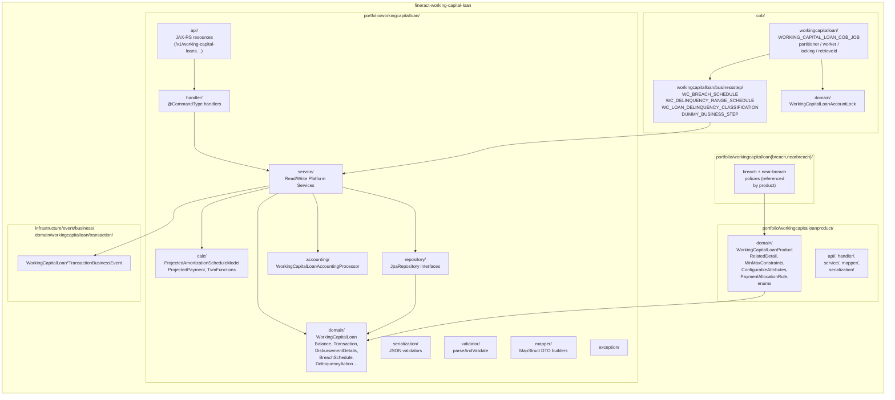
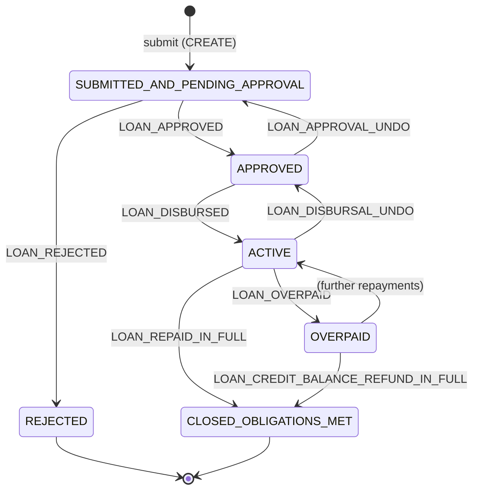

The `fineract-working-capital-loan` Gradle module is a standalone Apache Fineract portfolio extension that implements **working capital loans (WC loans)** — short-term, fee-discounted credit lines that can have multiple disbursements against a single application and whose schedule revolves around a single *projected amortization model* recomputed at every disbursement, payment, or rate change. It is a sibling of `fineract-loan`, not a child: WC loans get their own JPA entities, their own JSON command pipeline, their own COB (Close-Of-Business) batch job, and their own delinquency / breach machinery, while still reusing low-level Fineract building blocks (`LoanStatus`, `LoanTransactionType`, `DelinquencyBucket`, `MonetaryCurrency`, `ExternalId`, etc.) from `fineract-core` and `fineract-loan`.

This page is the source map for the module — every claim links back to a file under `/fineract-working-capital-loan/`, and every sibling page in this section drills into one sub-package.

## What kind of product is it?

WC loans differ from a classic Fineract progressive loan in three structural ways:

<CardGroup cols={3}>
  <Card title="Multi-disbursement" icon="layer-group">
    A single WC loan application can plan a sequence of `WorkingCapitalLoanDisbursementDetails` rows (expected vs actual amount, expected vs actual date), and the schedule is regenerated each time an actual disbursement is recorded.

    See `portfolio/workingcapitalloan/domain/WorkingCapitalLoanDisbursementDetails.java` and `calc/ProjectedAmortizationScheduleModel.regenerate(...)`.
  </Card>
  <Card title="Discount-fee economics" icon="percent">
    Principal is decomposed into `netDisbursementAmount` and `discountFeeAmount` (originating fee). The borrower receives `net`; payments retire `net + discount` over the term, computed from a `periodPaymentRate` and `npvDayCount` rather than an APR.

    See `calc/ProjectedAmortizationScheduleModel.generate(...)`.
  </Card>
  <Card title="Revolves via rate changes" icon="rotate">
    Mid-life rate changes are first-class: `applyRateChange(...)` appends a `RateSegment` to the model and rebuilds the projected payment list **in place**, instead of producing a brand-new schedule like progressive amortization does.

    See `calc/ProjectedAmortizationScheduleModel.applyRateChange(...)` and `domain/WorkingCapitalLoanPeriodPaymentRateChange.java`.
  </Card>
</CardGroup>

There is no concept of "interest accrual" in the classical sense. Every projected payment carries an `expectedAmortizationAmount` (NPV-style) and an `actualAmortizationAmount` (cursor-based consumption proportional to the actual payment ratio), and the rest of the model lives in `calc/ProjectedPayment.java`.

## Where the code lives

The module is rooted at `fineract-working-capital-loan/src/main/java/org/apache/fineract/`, with the **portfolio** code under `portfolio/workingcapitalloan/`, the **product** code under `portfolio/workingcapitalloanproduct/`, the **(near-)breach** policy code under `portfolio/workingcapitalloanbreach/` and `portfolio/workingcapitalloannearbreach/`, and the **COB infrastructure** under `cob/workingcapitalloan/` and `cob/domain/`. Business events live in `infrastructure/event/business/domain/workingcapitalloan/`.



The 246 Java files in the module break down roughly as:

| Slice | Path | Highlights |
| --- | --- | --- |
| Portfolio domain | `portfolio/workingcapitalloan/domain/` | `WorkingCapitalLoan`, `WorkingCapitalLoanBalance`, `WorkingCapitalLoanTransaction`, `WorkingCapitalLoanDisbursementDetails`, `WorkingCapitalLoanBreachSchedule`, `WorkingCapitalLoanDelinquencyAction`, `WorkingCapitalLoanDelinquencyRangeSchedule`, `WorkingCapitalLoanPeriodPaymentRateChange`, `WorkingCapitalLoanLifecycleStateMachine` |
| Product domain | `portfolio/workingcapitalloanproduct/domain/` | `WorkingCapitalLoanProduct`, `WorkingCapitalLoanProductRelatedDetail` (embeddable), `WorkingCapitalLoanProductMinMaxConstraints`, `WorkingCapitalLoanProductConfigurableAttributes`, `WorkingCapitalLoanProductPaymentAllocationRule`, enums (`WorkingCapitalAccountingRuleType`, `WorkingCapitalAmortizationType`, `WorkingCapitalBreachAmountCalculationType`, `WorkingCapitalLoanDelinquencyStartType`, `WorkingCapitalPaymentAllocationType`) |
| Calculation | `portfolio/workingcapitalloan/calc/` | `ProjectedAmortizationScheduleCalculator` + `DefaultProjectedAmortizationScheduleCalculator`, the `ProjectedAmortizationScheduleModel` (JSON-persisted), `ProjectedPayment`, `TvmFunctions` (Newton-Raphson `rate`) |
| Persistence | `portfolio/workingcapitalloan/repository/` (10 repos) and `portfolio/workingcapitalloanproduct/repository/` (2 repos) | Spring Data `JpaRepository` interfaces; the master one is `WorkingCapitalLoanRepository` which extends `JpaSpecificationExecutor` and exposes the COB-batch projections `COBIdAndExternalIdAndAccountNo` / `COBIdAndLastClosedBusinessDate` |
| REST API | `portfolio/workingcapitalloan/api/` + `portfolio/workingcapitalloanproduct/api/` + breach / near-breach APIs | Rooted at `/v1/working-capital-loans`, `/v1/working-capital-loan-products`, `/v1/working-capital/breach`, `/v1/working-capital/near-breach`, plus an internal `/v1/internal/working-capital-loans` resource |
| Command handlers | `portfolio/workingcapitalloan/handler/` (14 handlers) + product / breach / near-breach handlers | All annotated `@CommandType(entity = "WORKINGCAPITALLOAN"\|…, action = …)` |
| COB job | `cob/workingcapitalloan/` (Spring Batch) + `cob/workingcapitalloan/businessstep/` | The `JobName.WORKING_CAPITAL_LOAN_COB_JOB` registered in `fineract-core/JobName.java` runs four pluggable business steps |
| Locking | `cob/domain/WorkingCapitalLoanAccountLock`, `WorkingCapitalAccountLockRepository`, `CustomWorkingCapitalLoanAccountLockRepositoryImpl` | Table `m_wc_loan_account_locks`, parallels `m_loan_account_locks` from `fineract-loan` |
| Business events | `infrastructure/event/business/domain/workingcapitalloan/transaction/` | `WorkingCapitalLoanDisbursalTransactionBusinessEvent`, `…UndoDisbursalTransactionBusinessEvent`, `…RepaymentTransactionBusinessEvent`, `…DiscountFeeTransactionBusinessEvent`, `…CreditBalanceRefundTransactionBusinessEvent`, all extending an abstract `WorkingCapitalLoanTransactionBusinessEvent` with category `"WorkingCapitalLoan"` |

## Relationship to `fineract-loan`: composition, not extension

The Gradle dependency declaration in `fineract-working-capital-loan/dependencies.gradle` makes the boundary explicit:

```groovy
dependencies {
    implementation(project(path: ':fineract-core'))
    implementation(project(path: ':fineract-loan'))
    implementation(project(path: ':fineract-accounting'))
    implementation(project(path: ':fineract-cob'))
    ...
}
```

WC loans **depend on** `fineract-loan` and `fineract-cob` but do not extend their entities. The relationship is reuse-by-composition:

<CardGroup cols={2}>
  <Card title="What WC loans reuse from fineract-loan" icon="recycle">
    - `LoanStatus` + `LoanStatusConverter` — same lifecycle states (`SUBMITTED_AND_PENDING_APPROVAL`, `APPROVED`, `ACTIVE`, `REJECTED`, `CLOSED_OBLIGATIONS_MET`, `OVERPAID`) used in `WorkingCapitalLoan.loanStatus` (see `domain/WorkingCapitalLoan.java`).
    - `LoanTransactionType` + `LoanTransactionTypeConverter` — same transaction codes (`DISBURSEMENT`, `REPAYMENT`, `CREDIT_BALANCE_REFUND`, …) stored on `WorkingCapitalLoanTransaction.transactionType` (see `domain/WorkingCapitalLoanTransaction.java`).
    - `LoanTransactionRelationTypeEnum` — chain transactions via `WorkingCapitalLoanTransactionRelation` (see `domain/WorkingCapitalLoanTransactionRelation.java`).
    - `PaymentAllocationTransactionType` from `loanproduct` — used by the product-level `WorkingCapitalLoanProductPaymentAllocationRule` and the loan-level `WorkingCapitalLoanPaymentAllocationRule`.
    - `DelinquencyRange`, `DelinquencyBucket`, `DelinquencyAction`, `DelinquencyMinimumPaymentType`, `DelinquencyFrequencyType` from `portfolio.delinquency.domain` — referenced by `WorkingCapitalLoanDelinquencyAction` and the range/tag history entities.
  </Card>
  <Card title="What WC loans replace" icon="layer-group">
    - **Tables.** WC has its own `m_wc_loan`, `m_wc_loan_transaction`, `m_wc_loan_balance`, `m_wc_loan_disbursement_detail`, `m_wc_loan_payment_allocation_rule`, `m_wc_loan_breach_schedule`, `m_wc_loan_delinquency_range_schedule`, `m_wc_loan_delinquency_action`, `m_wc_loan_range_delinquency_tag`, `m_wc_loan_product`, `m_wc_loan_product_payment_allocation_rule`, `m_wc_loan_product_configurable_attributes`, `m_wc_loan_account_locks` (see each `@Table` annotation).
    - **Schedule engine.** `EMICalculator` (progressive) and `LoanScheduleAssembler` (cumulative) are NOT used. WC has its own `ProjectedAmortizationScheduleCalculator` interface (`calc/ProjectedAmortizationScheduleCalculator.java`) implemented by `DefaultProjectedAmortizationScheduleCalculator` (`calc/DefaultProjectedAmortizationScheduleCalculator.java`).
    - **Command pipeline.** Every WC command has its own handler (`portfolio/workingcapitalloan/handler/*CommandHandler.java`) registered against `entity = "WORKINGCAPITALLOAN"` (or `"WORKINGCAPITALLOANPRODUCT"`, `"WORKINGCAPITALBREACH"`, `"WORKINGCAPITALNEARBREACH"`).
    - **COB job.** A dedicated `WORKING_CAPITAL_LOAN_COB_JOB` (see `fineract-core/JobName.java` line 63) runs in parallel to the classic `LOAN_COB`, sharing the partition / lock / business-step machinery from `fineract-cob` but with WC-typed beans.
  </Card>
</CardGroup>

The two products can therefore coexist in one deployment: a classic loan goes through `m_loan` + `LOAN_COB`, a WC loan goes through `m_wc_loan` + `WORKING_CAPITAL_LOAN_COB_JOB`, and the catch-up REST resource for WC loans is even hosted in `fineract-provider` (`fineract-provider/src/main/java/org/apache/fineract/cob/api/WorkingCapitalLoanCOBCatchUpApiResource.java`) at `/v1/working-capital-loans/catch-up` so operators can drive the two flows independently.

## Lifecycle in one diagram

The WC loan lifecycle is implemented as `WorkingCapitalLoanLifecycleStateMachine` (see `domain/WorkingCapitalLoanLifecycleStateMachine.java`), and the events it consumes are the `WorkingCapitalLoanEvent` enum (`domain/WorkingCapitalLoanEvent.java`):



This is the exact `switch` inside `WorkingCapitalLoanLifecycleStateMachine.getNextStatus(...)`. Every command handler under `portfolio/workingcapitalloan/handler/` raises one of these events; the rest of the module (balance recomputation, schedule mutation, accounting, business events, COB locking) chains off the resulting status transition.

## What the rest of this section covers

<CardGroup cols={2}>
  <Card title="Domain & product" icon="database" href="/working-capital-loan/domain-and-product">
    Field-by-field tour of every JPA entity in `portfolio/workingcapitalloan/domain/` and `portfolio/workingcapitalloanproduct/domain/`, plus the 10 + 2 Spring Data repositories. Includes the ER diagram.
  </Card>
  <Card title="Calc & schedule" icon="calculator" href="/working-capital-loan/calc-and-schedule">
    Walks through `ProjectedAmortizationScheduleModel`, `ProjectedPayment`, `RateSegment`, the NPV / EIR math in `TvmFunctions`, and how multi-disbursement + rate changes mutate the model in-place.
  </Card>
  <Card title="API & handlers" icon="square-code" href="/working-capital-loan/api-and-handlers">
    Endpoint table for `/v1/working-capital-loans`, `/v1/working-capital-loan-products`, `/v1/working-capital/breach`, `/v1/working-capital/near-breach`, plus the `@CommandType` catalogue and the JSON validators.
  </Card>
  <Card title="COB & business steps" icon="clock-rotate-left" href="/working-capital-loan/cob-business-steps">
    The `WORKING_CAPITAL_LOAN_COB_JOB` partitioner/worker pipeline, the four business steps (`WC_BREACH_SCHEDULE`, `WC_DELINQUENCY_RANGE_SCHEDULE`, `WC_LOAN_DELINQUENCY_CLASSIFICATION`, `DUMMY_BUSINESS_STEP`), the locking model, and the catch-up REST resource in `fineract-provider`.
  </Card>
</CardGroup>

## File-by-file landmarks

A few files are worth opening before you read the other pages, because they anchor everything else:

<Steps>
  <Step title="WorkingCapitalLoan.java (the aggregate root)">
    `portfolio/workingcapitalloan/domain/WorkingCapitalLoan.java` — `@Table(name = "m_wc_loan")`, owns `WorkingCapitalLoanBalance` 1:1, `WorkingCapitalLoanPaymentAllocationRule[]` 1:N, `WorkingCapitalLoanDisbursementDetails[]` 1:N, `WorkingCapitalLoanTransaction[]` 1:N (ordered by `transactionDate, createdDate, id`), embeds `WorkingCapitalLoanProductRelatedDetails`. Tracks `loanCounter` (all WC loans for the client) and `loanProductCounter` (per client+product cycle).
  </Step>
  <Step title="WorkingCapitalLoanProduct.java (the configuration root)">
    `portfolio/workingcapitalloanproduct/domain/WorkingCapitalLoanProduct.java` — `@Table(name = "m_wc_loan_product")`, holds `WorkingCapitalAccountingRuleType` (NONE | CASH_BASED), an embedded `WorkingCapitalLoanProductRelatedDetail` (amortization type, npv day count, principal, period payment rate, repayment every / frequency, discount, delinquency grace days, delinquency start type), `WorkingCapitalLoanProductMinMaxConstraints` for principal and period payment rate ranges, `WorkingCapitalLoanProductConfigurableAttributes` for per-instance overrides, plus links to `WorkingCapitalBreach` and `WorkingCapitalNearBreach` policies.
  </Step>
  <Step title="ProjectedAmortizationScheduleModel.java (the schedule)">
    `portfolio/workingcapitalloan/calc/ProjectedAmortizationScheduleModel.java` — versioned (`MODEL_VERSION = "3"`), persisted as JSON in `m_wc_loan_projected_amortization_model.json_model` via `ProjectedAmortizationLoanModel`. Lifecycle methods: `generate`, `regenerate`, `applyPayment`, `applyRateChange`. Carries the `expectedPaymentAmount = (TPV × periodPaymentRate) / npvDayCount`, the derived `originalPaymentNumber`, and the periodic `effectiveInterestRate` from `TvmFunctions.rate(...)`.
  </Step>
  <Step title="WorkingCapitalLoanCOBConstant.java (the COB anchor)">
    `cob/workingcapitalloan/WorkingCapitalLoanCOBConstant.java` — declares the job name (`WORKING_CAPITAL_JOB_NAME = "WC_LOAN_COB"`, human name `"Working Capital Loan COB"`), the bean names for the partitioner / worker step / business step flow, and the inline variant `INLINE_WORKING_CAPITAL_LOAN_COB_JOB_NAME = "INLINE_WORKING_CAPITAL_LOAN_COB"` used by the API filter to catch up a single loan synchronously.
  </Step>
  <Step title="WorkingCapitalLoanCOBCatchUpApiResource.java (operator entry point)">
    `fineract-provider/src/main/java/org/apache/fineract/cob/api/WorkingCapitalLoanCOBCatchUpApiResource.java` — three endpoints under `/v1/working-capital-loans`: `GET oldest-cob-closed`, `POST catch-up`, `GET is-catch-up-running`. Wraps an `Optional<WorkingCapitalLoanCOBCatchUpServiceImpl>` so the resource quietly disables itself if the catch-up service isn't on the classpath.
  </Step>
</Steps>

<Note>
The module's *non-extension* posture matters for upgrades: changes to `fineract-loan`'s schedule engine, transaction processor, or accounting flow do **not** automatically affect WC loans. Each fix to a shared concern (e.g., a new `LoanStatus` value or a `LoanTransactionType` semantic) has to be re-applied to the WC mirror entities and the WC handlers. The `validator/`, `serialization/`, `mapper/`, and `accounting/` packages are deliberately WC-typed for this reason.
</Note>

## Module dependency surface

The full `dependencies` block in `fineract-working-capital-loan/dependencies.gradle` declares the upstream contract. The headline entries that drive the module's design are:

- `:fineract-core` — entity primitives, `JobName.WORKING_CAPITAL_LOAN_COB_JOB`, `AbstractAuditableWithUTCDateTimeCustom`, `ExternalId`, `MonetaryCurrency`, `ApiFacingEnum`, `StringEnumOptionData`, the command-wrapper builder.
- `:fineract-loan` — `LoanStatus`, `LoanTransactionType`, `LoanTransactionRelationTypeEnum`, `PaymentAllocationTransactionType`, `DelinquencyRange`, `DelinquencyBucket`, the `DelinquencyAction` enum.
- `:fineract-accounting` — base journal-entry plumbing called from `accounting/WorkingCapitalLoanAccountingProcessor`.
- `:fineract-cob` — `COBBusinessStep`, `COBConstant`, `CommonPartitioner`, `LockingService`, `AbstractLockingService`, `ApplyCommonLockTasklet`, `RetrieveIdService`, `BeforeStepLockingItemReaderHelper`.
- `:fineract-avro-schemas` — Avro-encoded business-event payloads emitted by the `infrastructure/event/business/.../workingcapitalloan/transaction/` events.
- `spring-batch-integration` — drives `WorkingCapitalLoanCOBManagerConfiguration` (manager) and `WorkingCapitalLoanCOBWorkerConfiguration` (worker) for partitioned remote execution.
- `mapstruct`, `gson`, `lombok`, `resilience4j-spring-boot3`, `springdoc-openapi-starter-webmvc-ui` — code-gen + serialization + circuit-breaker + OpenAPI.

The next page (`domain-and-product`) opens the JPA model and walks each table and its repository interface.
